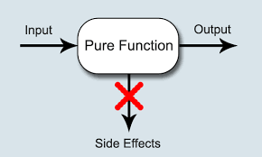
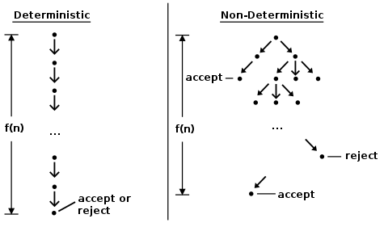

```haskell
    class Monad m where  
        return :: a -> m a  

        (>>=) :: m a -> (a -> m b) -> m b  

        (>>) :: m a -> m b -> m b  
        x >> y = x >>= \_ -> y  

        fail :: String -> m a  
        fail msg = error msg 

    instance Monad [] where  
        return x = [x]  
        xs >>= f = concat (map f xs)  
        fail _ = []  


```


# A _Fistful_(as much as a person can hold in their clenched hand) of Monads
---
## Functor
When we first talked about **functors**, 
  - we saw that they were 
      - **a useful concept** 
        - **for values** 
          - that **can be mapped over**. 
---
## Applicative
Then, we took that concept one step further by introducing **applicative functors**, 
  - which allow us 
      - to view values of certain data types 
        - as **values with contexts** and 
      - use **normal functions** on those values 
        - while **preserving** the meaning of those contexts.

In this chapter, we'll learn about monads, which 
are just _beefed_(used as food) up applicative functors, 
much like applicative functors are only beefed up functors.

When we started off with functors, we saw that it's 
possible to map functions over various data types. 
We saw that for this purpose, the Functor type class was introduced and it had us 
asking the question: 
when we have a function of type a -> b and some data type f a, 
how do we map that function over the data type to end up with f b? 
We saw how to map something over a Maybe a, a list [a], an IO a etc. 


## (->) r
We even saw how to map a 
  - function a -> b 
      - over other functions of type 
          - r -> a 
            - to get functions of type 
                - r -> b. 

To answer this question of how to map a function over some data type, 
all we had to do was look at the type of fmap:

    fmap :: (Functor f) => (a -> b) -> f a -> f b  

And then make it work for our data type by writing the appropriate Functor instance.

Then we saw a possible improvement of functors and said, hey, 
what if that function a -> b is already wrapped inside a functor value? Like, 
what if we have Just (*3), how do we apply that to Just 5? 
What if we don't want to apply it to Just 5 but to a Nothing instead? Or 
if we have [(*2),(+4)], how would we apply that to [1,2,3]? 
How would that work even? 
  - For this, 
    - the Applicative **type class** was introduced,

in which we wanted the answer to the following type:

    (<*>) :: (Applicative f) => f (a -> b) -> f a -> f b  

---
We also saw that we can take **a normal value** and **wrap** it **inside a data type**. 

For instance, 

we can take a 1 and wrap it so that it becomes a Just 1. 
Or we can make it into a [1]. 

Or **an I/O action** that **does nothing** and **just yields 1**. 

 

The function that does this is called **pure**.

Like we said, **an applicative value** can be seen 
  - as a value **with an added context**. 
  - **A fancy value**, 
  - to **put it in technical terms**. 

For instance,  
the character 'a' is just a normal character, 
_whereas_(in contrast or comparison with the fact that) 
Just 'a' has some added context. 

Instead of a Char,  
we have a Maybe Char, which tells us that its value might be a character, 
but it could also be an absence of a character.

It was _neat_(tidy) 
- to see how the Applicative **type class** 
  - allowed us 
    - to use 
      - normal functions on these values with context 
      - an how that context was preserved. 

Observe:
```haskell
  ghci> (*) <$> Just 2 <*> Just 8  
    Just 16  
  ghci> (++) <$> Just "klingon" <*> Nothing  
    Nothing  
  ghci> (-) <$> [3,4] <*> [1,2,3]  
    [2,1,0,3,2,1] 
```
Ah, cool, so now that we treat them as applicative values, 
Maybe a values represent computations that might have failed, 
[a] values represent computations that have several results (non-deterministic computations), 
IO a values represent values that have side-effects, etc.



Monads are a natural extension of applicative functors and with them we're concerned with this: 
if you have a value with a context, m a, how do you apply to it a function that 
takes a normal a and returns a value with a context? 
That is, how do you apply a function of type a -> m b to a value of type m a? 
So essentially, we will want this function:

    (>>=) :: (Monad m) => m a -> (a -> m b) -> m b  

If we have a fancy value and a function that takes a normal value 
but returns a fancy value, how do we feed that fancy value into the function? 
This is the main question that we will concern ourselves when dealing with monads. 
We write m a instead of f a because the m stands for Monad, 
but monads are just applicative functors that support >>=. 
The **>>= function** is pronounced as **bind**.

When we have a normal value a and a normal function a -> b 
it's really easy to feed the value to the function — 
you just apply the function to the value normally and that's it. 
But when we're dealing with values that come with certain contexts, 
it takes a bit of thinking to see how these fancy values are fed to functions and 
how to take into account their behavior, but you'll see that it's easy as one two three.


# Getting our feet wet with Maybe


Now that we have a _vague_(hazy; indistinct; cloudy) idea of what monads are about, 
let's see if we can make that idea a bit less vague.

Much to no one's surprise, Maybe is a monad, so let's explore it a bit more and 
see if we can combine it with what we know about monads.

Make sure you understand applicatives at this point. 
It's good if you have a feel for how the various Applicative instances work and 
what kind of computations they represent, because monads are nothing more than 
taking our existing applicative knowledge and upgrading it.

A value of type Maybe a represents a value of type a with the context of 
possible failure attached. A value of Just "dharma" means that the string "dharma" 
is there whereas a value of Nothing represents its absence, or 
if you look at the string as the result of a computation, 
it means that the computation has failed.

When we loked at Maybe as a functor, we saw that if we want to fmap a function over it, 
it gets mapped over the insides if it's a Just value, otherwise the Nothing is kept 
because there's nothing to map it over!
Like this:

```haskell
    ghci> fmap (++"!") (Just "wisdom")  
        Just "wisdom!"  
    ghci> fmap (++"!") Nothing  
    Nothing 
```
As an applicative functor, it functions similarly. However, applicatives also 
have the function wrapped. Maybe is an applicative functor in such a way that when we 
use <*> to apply a function inside a Maybe to a value that's inside a Maybe, 
they both have to be Just values for the result to be a Just value, otherwise the result 
is Nothing. It makes sense because if you're missing either the function or the thing 
you're applying it to, you can't make something up out of thin air, so you have to 
_propagate_(breed; generate) the failure:

```haskell
    ghci> Just (+3) <*> Just 3  
        Just 6  
    ghci> Nothing <*> Just "greed"  
        Nothing  
    ghci> Just ord <*> Nothing  
        Nothing  
```
When we use the applicative style to have normal functions act on Maybe values, 
it's similar. All the values have to be Just values, otherwise it's all for Nothing!

```haskell
    ghci> max <$> Just 3 <*> Just 6
        Just 6
    ghci> max <$> Just 3 <*> Nothing
        Nothing
```

And now, let's think about how we would do >>= for Maybe. 
Like we said, >>= takes a monadic value, and a function that takes a normal value and 
returns a monadic value and manages to apply that function to the monadic value. 
How does it do that, if the function takes a normal value? Well, to do that, 
it has to take into _account_(report; description; news) the context of that monadic value.

In this case, >>= would take a Maybe a value and a function of type a -> Maybe b and 
_somehow_(in some way; by some means) apply the function to the Maybe a. 
To _figure_(calculate; number; statistic) out how it does that, we can 
use the intuition that we have from Maybe being an applicative functor. Let's 
say that we have a function \x -> Just (x+1). It takes a number, adds 1 to it and wraps it in a Just:

```haskell
    ghci> (\x -> Just (x + 1)) 1
        Jsut 2
    ghci> (\x -> Just (x+1)) 100
        Just 101
```
If we feed it 1, it evaluates to Just 2. If we give it the number 100, 
the result is Just 101. Very _straightforward_(uncomplicated). 
Now here's the kicker: how do we feed a Maybe value to this function? 
If we think about how Maybe acts as an applicative functor, answering this is pretty easy. 
If we feed it a Just value, take what's inside the Just and apply the function to it. 
If give it a Nothing, hmm, well, then we're left with a function but Nothing to apply it to. 
In that case, let's just do what we did before and say that the result is Nothing.

Instead of calling it >>=, let's call it applyMaybe for now. It 
takes a Maybe a and a function that returns a Maybe b and 
manages to apply that function to the Maybe a. Here it is in code:

```haskell
    applyMaybe :: Maybe a -> (a -> Maybe b) -> Maybe b
        applyMaybe Nothing f = Nothing
        applyMaybe (Just x) f = f x
```
Okay, now let's play with it for a bit. We'll use it as an infix function 
so that the Maybe value is on the left side and the function on the right:
```haskell
    ghci> Just 3 `applyMaybe` \x -> Just (x+1)
        Just 4
    ghci> Just "smile" `applyMaybe` \x -> Just (x ++ " :)")
        Just "smile :)"
    ghci> Nothing `applyMaybe` \x -> Just (x+1)
        Nothing
    ghci> Nothing `applyMaybe` \x -> Just (x ++ " :)")
        Nothing
```
Just what we expected. If the monadic value on the left is a Nothing, 
the whole thing is Nothing. And if the function on the right returns a Nothing, 
the result is Nothing again. This is very similar to when we used Maybe 
as an applicative and we got a Nothing result if somewhere in there was a Nothing.

It looks like that for Maybe, we've figured out how to take a fancy value and 
feed it to a function that takes a normal value and returns a fancy one. 

We did this by keeping in mind that a Maybe value 
represents a computation that might have failed.

You might be asking yourself, how is this useful? 
It may seem like applicative functors are stronger than monads, 
since applicative functors allow us to take a normal function and 
make it operate on values with contexts. We'll see that monads can do that 
as well because they're an upgrade of applicative functors, and that they 
can also do some cool stuff that applicative functors can't.

We'll come back to Maybe in a minute, but first, let's check out the type class 
that belongs to monads.

---

# The Monad type class

Just like functors have the Functor type class and applicative functors 
have the Applicative type class, 
monads come with their own type class: Monad! Wow, who would have thought? 
This is what the type class looks like:

```haskell
    class Monad m where  
        return :: a -> m a  

        (>>=) :: m a -> (a -> m b) -> m b  

        (>>) :: m a -> m b -> m b  
        x >> y = x >>= \_ -> y  

        fail :: String -> m a  
        fail msg = error msg 
 ```
Let's start with the first line. It says class Monad m where. But wait, 
didn't we say that monads are just beefed up applicative functors? 
Shouldn't there be a class constraint in there along the lines of 

    class (Applicative m) = > Monad m where 
so that a type has to be an applicative functor first before it can be made a monad? 
Well, there should, but when Haskell was made, it hadn't occurred to people 
that applicative functors are a good fit for Haskell so they weren't in there. 
But rest assured, every monad is an applicative functor, even if the Monad class 
declaration doesn't say so.

The first function that the Monad type class defines is return. 
It's the same as pure, only with a different name. 
Its type is 

    (Monad m) => a -> m a. 
It takes a value and puts it in a minimal default context that still holds that value. In other words, it takes something and wraps it in a monad. It always does the same thing as the pure function from the Applicative type class, which means we're already acquainted with return. We already used return when doing I/O. We used it to take a value and make a bogus I/O action that does nothing but yield that value. For Maybe it takes a value and wraps it in a Just.

Just a reminder: return is nothing like the return that's in most other languages. 
It doesn't end function execution or anything, 
it just takes a normal value and puts it in a context.


The next function is _>>=_, or bind. It's like function application, 
only instead of taking a normal value and feeding it to a normal function, 
it takes a monadic value (that is, a value with a context) and feeds it to a function 
that takes a normal value but returns a monadic value.

Next up, we have _>>_. We won't pay too much attention to it for now because it 
comes with a default implementation and we pretty much never implement it 
when making Monad instances.

The final function of the Monad type class is fail. We never use it explicitly in our code. 
Instead, it's used by Haskell to enable failure in a special syntactic construct for monads 
that we'll meet later. We don't need to concern ourselves with fail too much for now.

Now that we know what the Monad type class looks like, let's take a look at how Maybe 
is an instance of Monad!

```haskell
    instance Monad Maybe where
        return x        = Just x
        Nothing >>= f   = Nothing
        Just x >>= f    = f x
        fail _          = Nothing
```

return is the same as pure, so that one's a no-brainer. 
We do what we did in the Applicative type class and wrap it in a Just.

The >>= function is the same as our applyMaybe. 
When feeding the Maybe a to our function, we keep in mind the context and 
return a Nothing if the value on the left is Nothing because if there's no value 
then there's no way to apply our function to it. If it's a Just we take what's inside 
and apply f to it.

We can play around with Maybe as a monad:

```haskell
    ghci> return "WHAT" :: Maybe String
        Just "WHAT"
    ghci> Just 9 >>= \x -> return (x*10)
        Just 90
    ghci> Nothing >>= \x -> return (x*10)
        Nothing
```
Nothing new or exciting on the first line since we already used pure with Maybe and we know 
that return is just pure with a different name. The next two lines showcase >>= a bit more.

Notice how when we fed Just 9 to the function \x -> return (x*10), the x took on the value 9 
inside the function. It seems as though we were able to extract the value from a Maybe 
without pattern-matching. 
And we still didn't lose the context of our Maybe value, 
because when it's Nothing, the result of using >>= will be Nothing as well.

---


# Walk the line

Now that we know how to feed a Maybe a value to a function of type a -> Maybe b 
while taking into account the context of possible failure, 
let's see how we can use >>= repeatedly to handle computations of several Maybe a values.

Pierre has decided to take a break from his job at the fish farm and try tightrope walking. 
He's not that bad at it, but he does have one problem: birds keep landing on his balancing pole! 
They come and they take a short rest, chat with their avian friends and then take off 
in search of breadcrumbs. This wouldn't bother him so much if the number of birds 
on the left side of the pole was always equal to the number of birds on the right side. 
But sometimes, all the birds decide that they like one side better and 
so they throw him off balance, which results 
in an _embarrassing_(shaming; shameful) _tumble_(fall suddenly) for Pierre 
(he's using a safety net).

Let's say that he keeps his balance if the number of birds on the left side of the pole 
and on the right side of the pole is within three. 
So if there's one bird on the right side and four birds on the left side, 
he's okay. But if a fifth bird lands on the left side, then he loses his balance and takes a dive.

We're going to _simulate_(fake; pretend; put on) birds landing on and flying away from the pole 
and see if Pierre is still at it after a certain number of birdy arrivals and departures. 
For instance, we want to see what happens to Pierre if first one bird arrives on the left side, 
then four birds occupy the right side and then the bird 
that was on the left side decides to fly away.

We can represent the pole with a simple pair of integers. 
The first component will _signify_(mark; denote; signal) the number of birds on the left side 
and the second component the number of birds on the right side:

    type Birds = Int
    type Pole = (Birds, Birds)

First we made a _type synonym_(the same meaning as another word) for Int, called _Birds_, 
because we're using integers to represent how many birds there are. 
And then we made _a type synonym (Birds,Birds)_ and we called it _Pole_ 
(not to be _confused_(puzzled) with a person of Polish descent).

Next up, how about we make a function that takes a number of birds 
and lands them on one side of the pole. Here are the functions:    

```haskell
    landLeft :: Birds -> Pole -> Pole
    landLeft n (left, right) = (left + n, right)

    landRight :: Birds -> Pole -> Pole
    landRight n (left, right) = (left, n + right)

    ghci> landLeft 2 (0,0)
        (2,0)
    ghci> landRight 1 (1,2)
        (1,3)
    ghci> landRight (-1) (1,2)
        (1,1)
```
To make birds _fly away_ we just had a _negative number_ of birds land on one side. 
Because landing a bird on the Pole returns a Pole, 
we can chain applications of landLeft and landRight:

    ghci> landLeft 2 (landRight 1 (landLeft 1(0,0)))
        (3,1)

When we apply the function landLeft 1 to (0,0) we get (1,0). 
Then, we land a bird on the right side, resulting in (1,1). 
Finally two birds land on the left side, resulting in (3,1). 
We apply a function to something by first writing the function and then writing its parameter, 
but here it would be better if the pole went first and then the landing function. 
If we make a function like this:

    x -: f = f x

We can apply functions by first writing the parameter and then the function:

```haskell
    ghci> 100 -: (*3)
        300
    ghci> True -: not
        False
    ghci> (0,0) -: landLeft 2
        (2,0)
```
By using this, we can repeatedly land birds on the pole in a more readable manner:

    ghci> (0,0) -: landLeft 1 -: landRight 1 -: landLeft 2
        (3,1)

Pretty cool! This example is equivalent to the one before where we repeatedly landed birds 
on the pole, only it looks neater. Here, it's more _obvious_(clear; plain) 
that we start off with (0,0) and then land one bird one the left, 
then one on the right and finally two on the left.

So far so good, but what happens if 10 birds land on one side?

    ghci> landLeft 10 (0,3)
        (10,3)

10 birds on the left side and only 3 on the right? 
That's sure to send poor Pierre falling through the air! This is pretty obvious here but 
what if we had a sequence of landings like this:

    ghci> (0,0) -: landLeft 1 -: landRight 4 -: landLeft (-1) -: landRight (-2)  
        (0,2)

It might seem like everything is okay but if you follow the steps here, 
you'll see that at one time there are 4 birds on the right side and no birds on the left! 
To fix this, we have to take another look at our landLeft and landRight functions. 
From what we've seen, we want these functions to be able to fail. That is, 

we want them to return a new pole if the balance is okay 

but fail if the birds land in 
a _lopsided_(unbalanced; unequal) _manner_(way; style; mode; fashion). 

And what better way to add a context of failure to value than by using Maybe! 
Let's rework these functions:

Instead of returning a Pole these functions now return a Maybe Pole. They still take the number of birds and the old pole as before, but then they check if landing that many birds on the pole would throw Pierre off balance. We use guards to check if the difference between the number of birds on the new pole is less than 4. If it is, we wrap the new pole in a Just and return that. If it isn't, we return a Nothing, indicating failure.

Let's give these babies a go:

```haskell
    landLeft :: Birds -> Pole -> Maybe Pole
    landLeft n (left,right)
        | abs ((left + n) - right) < 4 = Just (left + n, right)
        | otherwise                    = Nothing

    landRight :: Birds -> Pole -> Maybe Pole
    landRight n (left,right)
        | abs (left - (right + n)) < 4 = Just (left, right + n)
        | otherwise                    = Nothing

    ghci> landLeft 2 (0,0)
        Just (2,0)
    ghci> landLeft 10 (0,3)
        Nothing
```
Nice! When we land birds without throwing Pierre off balance, we get a new pole wrapped in a Just. 
But when many more birds end up on one side of the pole, we get a Nothing. 
This is cool, but we seem to have lost the ability to repeatedly land birds on the pole. 
We can't do landLeft 1 (landRight 1 (0,0)) anymore because when we apply landRight 1 to (0,0), 
we don't get a Pole, but a Maybe Pole. landLeft 1 takes a Pole and not a Maybe Pole.

We need a way of taking a Maybe Pole and feeding it to a function that takes a Pole and 
returns a Maybe Pole. Luckily, we have >>=, which does just that for Maybe. Let's give it a go:

    ghci> landRight 1 (0,0) >>= landLeft 2  
        Just (2,1)  

Remember, landLeft 2 has a type of Pole -> Maybe Pole. We couldn't just feed it the Maybe Pole 
that is the result of landRight 1 (0,0), so we use >>= to take that value with a context and 
give it to landLeft 2. >>= does indeed allow us to treat the Maybe value as a value with context 
because if we feed a Nothing into landLeft 2, the result is Nothing and 

the failure is _propagated_(breed; generate):

    ghci> Nothing >>= landLeft 2  
        Nothing  

With this, we can now chain landings that may fail because >>= allows us to feed a monadic value 
to a function that takes a normal one.

Here's a sequence of birdy landings:
 
    ghci> return (0,0) >>= landRight 2 >>= landLeft 2 >>= landRight 2  
        Just (2,4)  

At the beginning, we used _return_ to take a pole and wrap it in a Just. 
We could have just applied landRight 2 to (0,0), it would have been the same, 

but this way we can be more _consistent_(steady; constant; uniform; regular) 
by using >>= for every function. 

Just (0,0) gets fed to landRight 2, resulting in Just (0,2). 
This, in turn, gets fed to landLeft 2, resulting in Just (2,2), and so on.

Remember this example from before we introduced failure into i
Pierre's _routine_(practice; procedure; regular; drill; plan; method) :

    ghci> (0,0) -: landLeft 1 -: landRight 4 -: landLeft (-1) -: landRight (-2)  
        (0,2)  

It didn't simulate his interaction with birds very well because in the middle there 
his balance was off but the result didn't reflect that. 
But let's give that a go now by using monadic application (>>=) instead of normal application:

    ghci> return (0,0) >>= landLeft 1 >>= landRight 4 >>= landLeft (-1) >>= landRight (-2)  
        Nothing  

Awesome. The final result represents failure, which is what we expected. 
Let's see how this result was obtained. First, return puts (0,0) into a default context, 
making it a Just (0,0). Then, Just (0,0) >>= landLeft 1 happens. 
Since the Just (0,0) is a Just value, landLeft 1 gets applied to (0,0), resulting in a Just (1,0), 
because the birds are still relatively balanced. 
Next, Just (1,0) >>= landRight 4 takes place and the result is Just (1,4) as 
the balance of the birds is still intact, although just barely. 
Just (1,4) gets fed to landLeft (-1). This means that landLeft (-1) (1,4) takes place. 
Now because of how landLeft works, this results in a Nothing, because 
the resulting pole is off balance. Now that we have a Nothing, it gets fed to landRight (-2), 
but because it's a Nothing, the result is automatically Nothing, 
as we have nothing to apply landRight (-2) to.

We couldn't have achieved this by just using Maybe as an applicative. If you try it, 
you'll get stuck, because applicative functors don't allow for the applicative values 
to interact with each other very much. They can, at best, be used as parameters to a function 
by using the applicative style. 

The applicative operators will fetch their results and 
feed them to the function in a manner appropriate for each applicative and then 
put the final applicative value together, but there isn't that much interaction going on 
between them. Here, however, each step relies on the previous one's result. On every landing, 
the possible result from the previous one is examined and the pole is checked for balance. 
This determines whether the landing will succeed or fail.

We may also _devise_(come up with; dream up; think up) a function 
that ignores the current number of birds on the balancing pole and just makes Pierre slip and fall.
We can call it _banana_:

    
    banana :: Pole -> Maybe Pole
    banana _ = Nothing

Now we can chain it together with our bird landings. It will always cause our walker to fall, 
because it ignores whatever's passed to it and always returns a failure. Check it:

    ghci> return (0,0) >>= landLeft 1 >>= banana >>= landRight 1  
        Nothing  

The value Just (1,0) gets fed to banana, but it produces a Nothing, which causes everything 
to result in a Nothing. How unfortunate!

Instead of making functions that ignore their input and just return 
a _predetermined_(preset; pre-agree; prearranged) monadic value, 
we can use the >> function, whose default implementation is this:

    (>>) :: (Monad m) => m a -> m b -> m b
    m >> n = m >>= \_ -> n

Normally, passing some value to a function that _ignores its parameter_ and 
_always just returns some predetermined value_ would always result in that predetermined value. 
With monads however, their context and meaning has to be considered as well. 
Here's how >> acts with Maybe:

    ghci> Nothing >> Just 3  
        Nothing  
    ghci> Just 3 >> Just 4  
        Just 4  
    ghci> Just 3 >> Nothing  
        Nothing  

If you replace >> with >>= \_ ->, it's easy to see why it acts like it does.

We can replace our banana function in the chain with a >> and then a Nothing:

    ghci> return (0,0) >>= landLeft 1 >> Nothing >>= landRight 1  
        Nothing 

There we go, _guaranteed_(promise; warranty) and obvious failure!

It's also worth taking a look at what this would look like if we hadn't 
made the clever choice of treating Maybe values as values with a failure context and 
feeding them to functions like we did. 
Here's how a series of bird landings would look like:

```haskell

    routine :: Maybe Pole
    routine = case landLeft 1 (0,0) of
        Nothing -> Nothing
        Just pole1 -> case landRight 4 pole1 of
            Nothing -> Nothing
            Just pole2 -> case landLeft 2 pole2 of
                Nothing -> Nothing
                Just pole3 -> landLeft 1 pole3

```
We land a bird on the left and then we examine the possibility of failure and 
the possibility of success. In the case of failure, we return a Nothing. In the case of success, 
we land birds on the right and then do the same thing all over again. 

Converting this _monstrosity_(eyesore; horror) into a neat chain of monadic applications 
with >>= is a classic example of how the Maybe monad saves us a lot of time 
when we have to successively do computations that are based on computations that might have failed.

In this section, we took some functions that we had and saw that they would work better 
if the values that they returned supported failure. 
By turning those values into Maybe values and replacing normal function application with >>=, 
we got a mechanism for handling failure pretty much for free, 
because >>= is supposed to preserve the context of the value to which it applies functions. 
In this case, the _context_ was that our values were values with failure and so when we applied 
functions to such values, the possibility of failure was always taken into _account_(report).


## do notation

Monads in Haskell are so useful that they got their own special syntax called do notation. 
We've already encountered do notation when we were doing I/O and there we said that it 
was for gluing together several I/O actions into one. Well, as it turns out, 
_do notation_ isn't just for IO, but _can be used for any monad_. 
Its principle is still the same: gluing together monadic values in sequence. 
We're going to take a look at how do notation works and why it's useful.

Consider this familiar example of monadic application:

```haskell
    ghci> Just 3 >>= (\x -> Just (show x ++ "!"))  
        Just "3!"  
```
Been there, done that. Feeding a monadic value to a function that returns one, no big deal. 

Notice how when we do this, 
    - x becomes 3 inside the lambda. 
        - Once we're inside that lambda, 
        - it's just a normal value rather than a monadic value. 

Now, what if we had another >>= inside that function? Check this out:

```haskell

    ghci> Just 3 >>= (\x -> Just "!" >>= (\y -> Just (show x ++ y)))  
        Just "3!"  
```
Ah, a _nested use_ of _>>=_! 

**In the outermost lambda**, 

    - we feed Just "!" to the lambda \y -> Just (show x ++ y). 

**Inside this lambda**,

    - the y becomes "!". 
    - x is still 3 
        - because we got it from the outer lambda. 

All this sort of reminds me of the following expression:

```haskell

    ghci> let x = 3; y = "!" in show x ++ y  
        "3!"  
```

The main difference between these two is that the values 
in the _former_(forgoing; previous) example are monadic. 
They're values with a failure context. We can replace any of them with a failure:
```haskell

    ghci> Nothing >>= (\x -> Just "!" >>= (\y -> Just (show x ++ y)))
        Nothing
    ghci> Just 3 >>= (\x -> Nothing >>= (\y -> Just (show x ++ y)))
        Nothing
    ghci> Just 3 >>= (\x -> Just "!" >>= (\y -> Nothing))
        Nothing
```
In the first line, feeding a Nothing to a function naturally results in a Nothing. 
In the second line, we feed Just 3 to a function and the x becomes 3, 
but then we feed a Nothing to _the inner lambda_ and the result of that is Nothing, 
which causes the outer lambda to produce Nothing as well. 

So this is sort of like _assigning_ **values** _to_ **variables** _in_ **let** _expressions_, 
only that the values in question are monadic values.

To further illustrate this point, 
let's write this in a script and _have_ each Maybe value _take up_ its own line:
```haskell

    foo :: Maybe String  
    foo = Just 3   >>= (\x -> 
          Just "!" >>= (\y -> 
          Just (show x ++ y)))

    foo :: Maybe String  
    foo = do  
        x <- Just 3  
        y <- Just "!"  
        Just (show x ++ y)  

```
To save us from writing all these annoying lambdas, 
Haskell gives us do notation. 
It allows us to write the previous piece of code like this:

It would seem as though we've gained the ability to temporarily extract things from Maybe values 
without having to check if the Maybe values are Just values or Nothing values at every step. 

How cool! If any of the values that we try to extract from are Nothing, 
the whole do expression will result in a Nothing. 

We're yanking out their (possibly existing) values and 
letting >>= _worry_(get worked up) about the context that comes with those values. 

It's important to remember that do expressions are 
just different _syntax_(the arrangement of words) for _chaining_ monadic values.


In a do expression, every line is a monadic value.
To inspect its result, 

```haskell

    foo :: Maybe String  
    foo = Just 3   >>= (\x -> 
          Just "!" >>= (\y -> 
          Just (show x ++ y)))

    foo :: Maybe String  
    foo = do  
        x <- Just 3  
        y <- Just "!"  
        Just (show x ++ y)  

```
we use 

    <- 
        If we have a Maybe String and 
            we bind it with <- to a variable, 
                that variable will be a String, 

    just like when we used 
    >>= 
        to feed monadic values to lambdas. 

    The last 
    monadic value in a do expression, 
        like Just (show x ++ y) here, 
            can't be used with <- to bind its result, 
                because that wouldn't make sense if we 
                    translated the do expression 
                    back to a chain of >>= applications. 

    Rather, 
    its result is 
        the result of the whole glued up monadic value, 
            taking into account the possible failure of any of the previous ones.

For instance, examine the following line:
```haskell
    ghci> Just 9 >>= (\x -> Just (x > 8))  
        Just True  
```
Because the left parameter of >>= is a Just value, the lambda is applied to 9 and 
the result is a Just True. If we rewrite this in do notation, we get:

```haskell

    marySue :: Maybe Bool
    marySue = do
        x <- Just 9
        Just (x > 8)

```
If we compare these two, 
it's easy to see why the result of the whole monadic value is the result of the last monadic value 
in the do expression with all the previous ones chained into it.

Our tightwalker's routine can also be expressed with do notation. 
landLeft and landRight take a number of birds and a pole and produce a pole wrapped in a Just, 
unless the tightwalker slips, in which case a Nothing is produced. 

We used >>= to chain successive steps because each one relied on the previous one and 
each one had an added context of possible failure. Here's two birds landing on the left side, 
then two birds landing on the right and then one bird landing on the left:

```haskell

    routine :: Maybe Pole
    routine = do
        start <- return (0,0)
        first <- landLeft 2 start
        second <- landRight 2 first
        landLeft 1 second

    -- Let's see if he succeeds:
    
    ghci> routine  
        Just (3,2)  

```

He does! Great. When we were doing these _routines_(a fixed program) 
by _explicitly_(in a clear) writing >>=, 
we usually said something like return (0,0) >>= landLeft 2, 
because landLeft 2 is a function that returns a Maybe value. 
With do expressions however, each line must feature a monadic value. 
So we explicitly pass the previous Pole to the landLeft landRight functions. 
If we examined the variables to which we bound our Maybe values, 
start would be (0,0), first would be (2,0) and so on.

Because do expressions are written line by line, 
they may look like _imperative_(of vital importance) code to some people. 
But the thing is, they're just sequential, 
as each value in each line relies on the result of the previous ones, 
along with their contexts (in this case, whether they succeeded or failed).

Again, let's take a look at what this piece of code would look like 

```haskell

-- if we hadn't used the monadic aspects of Maybe:

    routine :: Maybe Pole  
    routine =   
        case Just (0,0) of   
            Nothing -> Nothing  
            Just start -> case landLeft 2 start of  -- the tuple inside Just (0,0) becomes start 
                Nothing -> Nothing  
                Just first -> case landRight 2 first of  
                    Nothing -> Nothing  
                    Just second -> landLeft 1 -- second the result of landLeft 2 start becomes first 

    routine :: Maybe Pole  
    routine = do  
        start <- return (0,0)  
        first <- landLeft 2 start  
        Nothing  
        second <- landRight 2 first  
        landLeft 1 second  

```
When we write

    - a line in do notation 
        - without binding the monadic value with <-
            - it's just like 
            - putting >> after the monadic value 
            -   - whose result we want to ignore. 
            - We sequence the monadic value but we ignore its result 
            - because 
                - we don't care what it is and 
                - it's prettier than writing _ <- Nothing, 
                    - which is equivalent to the above.

When to use do notation and when to explicitly use >>= is up to you. 
I think this example lends itself to explicitly writing >>= 
because each step relies specifically on the result of the previous one. 
With do notation, we had to specifically write on which pole the birds are landing, 
but every time we used that came directly before. 
But still, it gave us some insight into do notation.

In do notation, 
when we bind monadic values to names, 
we can _utilize_(make use of; put to use) pattern matching, 
just like in let expressions and function parameters. 
Here's an example of pattern matching in a do expression:
```haskell

    justH :: Maybe Char
    justH = do
        (x:xs) <- Just "hello"
        return x

```
We use pattern matching to get the first character of the string "hello" 
and then we present it as the result. So justH evaluates to Just 'h'.

What if this pattern matching were to fail? 

When matching on a pattern in a function fails, 
the next pattern is matched.

If the matching falls through all the patterns for a given function, 
an error is thrown and our program crashes. 

On the other hand, _failed pattern matching_ in let expressions results in 
an error being produced _right away_(immediately), 

because the mechanism of falling through patterns 
isn't present in let expressions. 

_When pattern matching fails_ in a do expression, 
the _fail function_ is _called_. 

It's _part of the Monad_ type class and 
it _enables_ _failed_ _pattern matching_ 
to result in a failure in the context of the current monad 
instead of making our _program crash_. 

Its default implementation is this:

```haskell

    fail :: (Monad m) => String -> m a
    fail msg = error msg

```
So by default it does make our program crash, 
but monads that incorporate a context of possible failure (like Maybe) 
usually implement it on their own. 
For Maybe, its implemented like so:
```haskell
    fail _ = Nothing  
```
It ignores the error message and makes a Nothing. 
So when pattern matching fails in a Maybe value that's written in do notation, 
the whole value results in a Nothing. 
This is _preferable_(more desirable or suitable to having our program crash. 
Here's a do expression with a pattern that's bound to fail:
```haskell

    wopwop :: Maybe Char
    wopwop = do
        (x:xs) <- Just ""
        return x

    -- The pattern matching fails, 
    -- so the effect is the same as 
    -- if the whole line with the pattern was replaced with a Nothing. 
    -- Let's try this out:

    ghci> wopwop
        Nothing
```
The failed pattern matching has caused a failure within the context of our monad 
instead of causing a program-wide failure, which is pretty neat.


## The list monad

So far, 
we've seen how Maybe values can be viewed as values with a failure context 
and how we can incorporate failure handling into our code by 
using >>= to feed them to functions. In this section, we're going to 
take a look at how to use the monadic aspects of lists to bring 
non-determinism into our code in a clear and readable manner.

We've already talked about how lists represent non-deterministic values 
when they're used as applicatives. A value like 5 is deterministic. 
It has only one result and we know exactly what it is. 
On the other hand, a value like [3,8,9] contains several results, 
so we can view it as one value that is actually many values at the same time. 
Using lists as applicative functors showcases this non-determinism nicely:

```haskell

    ghci> (*) <$> [1,2,3] <*> [10,100,1000]
        [10,100,1000,20,200,2000,30,300,3000]

```
All the possible combinations of multiplying elements from the left list 
with elements from the right list are included in the resulting list. 

When dealing with non-determinism, 
there are many choices that we can make, 
so we just try all of them, and so the result is a non-deterministic value as well,
only it has many more results.

This context of non-determinism translates to monads very nicely. 
Let's go ahead and see what the Monad instance for lists looks like:

```haskell
instance Monad [] where
    return x = [x]
    xs >>= f = concat (map f xs)
    fail _ = []
```
return does the same thing as pure, so we should already be familiar with return 
for lists. It takes a value and puts it in a minimal default context that 
still yields that value. In other words, it makes a list that has 
only that one value as its result. This is useful for when we want to just 
wrap a normal value into a list so that it can interact with 
non-deterministic values.

To understand how >>= works for lists, 
it's best if we take a look at it in action to gain some intuition first. 

__>>=__ is about taking a value with a context (a monadic value) and feeding it 
to a function that takes a normal value and returns one that has context. 

If that function just produced a normal value instead of one with a context, 
__>>=__ wouldn't be so useful because after one use, the context would be lost. 

Anyway, let's try feeding a non-deterministic value to a function:

```haskell
    ghci> [3,4,5] >>= \x -> [x,-x]  
        [3,-3,4,-4,5,-5]  
```
When we used >>= with Maybe, 
the monadic value was fed into the function while taking care of possible failures.
Here, it takes care of non-determinism for us. 

[3,4,5] is a non-deterministic value and we feed it into a function that 
returns a non-deterministic value as well. The result is also non-deterministic, 
and it features all the possible results of taking elements from 
the list [3,4,5] and passing them to the function \x -> [x,-x]. 

This function takes a number and produces two results: 
one negated and one that's unchanged. So when we use >>= to feed this list 
to the function, every number is negated and also kept unchanged. 

The x from the lambda takes on every value from the list that's fed to it.

To see how this is achieved, we can just follow the implementation. 

First, 
we start off with the list [3,4,5]. Then, we map the lambda over it and 
the result is the following:

```haskell 
    [[3,-3],[4,-4],[5,-5]]  
```
The lambda is applied to every element and we get a list of lists. Finally, 
we just flatten the list and _voila_(there you are)! We've applied 
a non-deterministic function to a non-deterministic value!

Non-determinism also includes support for failure. 
The empty list [] is pretty much the equivalent of Nothing, because it 
signifies the absence of a result. That's why failing is just defined as 
the empty list. The error message gets thrown away. Let's play around 
with lists that fail:

```haskell

    ghci> [] >>= \x -> ["bad","mad","rad"]
        []
    ghci> [1,2,3] >>= \x -> []
        []

```
In the first line, an empty list is fed into the lambda. Because the list 
has no elements, none of them can be passed to the function and so the result 
is an empty list. This is similar to feeding Nothing to a function. 
In the second line, each element gets passed to the function, but the element 
is ignored and the function just returns an empty list. Because the function 
fails for every element that goes in it, the result is a failure.

Just like with Maybe values, we can chain several lists with >>=, 
propagating the non-determinism:

```haskell

    ghci> fmap (\n-> ['a','b']) [1,2]
        ["ab","ab"] -- [['a','b'],['a','b']]

    ghci> [1,2] >>= \n -> ['a','b']
        "abab" -- ['a','b','a','b']
    ghci> [1,2] >>= \n -> ['a','b'] >>= \ch -> return (n,ch)
        [(1,'a'),(1,'b'),(2,'a'),(2,'b')]


```
The list [1,2] gets bound to n and ['a','b'] gets bound to ch. Then, we do 
return (n,ch) (or [(n,ch)]), which means taking a pair of (n,ch) and putting it 
in a default minimal context. 

In this case, 
it's making the smallest possible list that still 
presents (n,ch) as the result and 
_features_(have as a distinctive attribute) as little non-determinism as possible. 

Its effect on the context is minimal. 

What we're saying here is this: 
- for every element in [1,2], 
- go over every element in ['a','b'] and 
- produce a tuple of one element from each list.

Generally speaking, because return takes a value and wraps it in a minimal context, 
it doesn't have any extra effect 
(like failing in Maybe or resulting in more non-determinism for lists) 
but it does present something as its result.

When you have _non-deterministic values interacting_, 
you can view their computation _as a tree_ where every possible result 
in a list represents a separate branch.

 

Here's the previous expression rewritten in do notation:

```haskell

    listOfTuples :: [(Int,Char)]
    listOfTuples = do
        n <- [1,2]
        ch <- ['a','b']
        return (n,ch)
```
This makes it a bit more obvious that n takes on every value from [1,2] and 
ch takes on every value from ['a','b']. Just like with Maybe, 
we're extracting the elements from the monadic values and 
treating them like normal values and >>= takes care of the context for us. 

The context in this case is non-determinism.

Using lists with do notation really reminds me of something we've seen before. 
Check out the following piece of code:

```hasekll
    ghci> [ (n,ch) | n <- [1,2], ch <- ['a','b'] ]  
        [(1,'a'),(1,'b'),(2,'a'),(2,'b')]  

````


