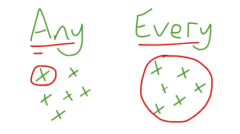

# Functor

```haskel
------------------------
class Functor f where --
------------------------
  fmap :: (a -> b) -> f a -> f b
  (<$>) :: (Functor f) => (a -> b) -> f a -> f b
  f <$> x = fmap f x


  instance Functor ((->) r) where
      fmap :: (a -> b) -> (->)r a -> (->)r b
      fmap :: (a -> b) -> (r -> a) -> (r -> b)
      fmap :: r -> a -> b

      fmap f g r = f (g(r))
      fmap f g = (\x -> f (g(x))
      fmap f g = f . g
      fmap = (.)

  instance Functor IO where
      fmap f action = do
          result <- action
          return (f result)

  instance Functor Maybe where
      fmap f (Just x) = Just (f x)
      fmap f Nothing = Nothing
```

---

# Applicative

```haskell
-------------------------------------------
class (Functor f) => Applicative f where --
-------------------------------------------
  pure :: a -> f a
  pure f <*> x = fmap f x

  (<*>) :: f (a -> b) -> f a -> f b


  instance Applicative ((->) r) where
      pure x = (\_ -> x)

      (<*>) :: ((->) r) (a -> b) -> ((->) r) a-> ((->) r) b)
      (<*>) :: (r -> (a -> b) -> (r -> a) -> (r -> b)
      (<*>) :: (r -> a -> b) -> (r -> a) -> (r -> b)
      --첫번째 파라 미터로 받는 applicative  f 는
            -- 첫번재 인자로 r 을 받고
            -- 두번재째 인자로 (g r) 의 결과값으로 나온 a 를 받는 함수로 정의 해야 함.
      -- 두번째 인자로 받는 applicative g 는 인자를 하나 받는 함수

      f <*> g r = f r (g r)
      f <*> g = \x -> f x (g x)
          -- ghci> (\x y z -> [x,y,z]) <$> (+3) <*> (*2) <*> (/2) $ 5
          --      [8.0,10.0,2.5]

  newtype ZipList a = ZipList {getZipList :: [a]}

  instance Applicative ZipList where
      pure x = ZipList (repeat x)
      ZipList fs <*> ZipList xs = ZipList (zipWith (\f x -> f x) fs xs)
```

---

# Monoid

```haskell

-----------------------
class Monoid m where --
-----------------------
    mempty :: m
    mappend :: m -> m -> m
    mconcat :: [m] -> m
    mconcat = foldr mappend mempty

    instance Monoid [a] where
      mempty = []
      mappend = (++)

    instance Monoid a => Monoid (Maybe a) where
      mempty = Nothing
      Nothing `mappend` m = m
      m `mappend` Nothing = m
      Just m1 `mappend` Just m2 = Just (m1 `mappend` m2)
```

---

# (->) r : functor

```haskell

  instance Functor ((->) r) where
      fmap = (.)

  instance Applicative ((->) a) where
      pure = const
      (<*>) f g x = f x (g x)

  instance Monad ((->) r) where
      f >>= k = \ r -> k (f r) r
```

---

# Functors, Applicative Functors and Monoids

Haskell's combination of

- **purity**,
- **higher order functions**,
- **parameterized algebraic data types**, and
- **typeclasses**

allows us to implement polymorphism on a much higher level than possible in other languages.

We don't have to think about types belonging to a big hierarchy of types.

Instead,  
we think about

- what the types can
  - act like  
     and then
  - connect them with the appropriate typeclasses.

An Int can act like a lot of things.

- It can act
  - like an equatable thing,
  - like an ordered thing,
  - like an enumerable thing, etc.

Typeclasses are open,
which means that we can define our own data type,
think about what it can act like and
connect it with the typeclasses that define its behaviors.

Because of that
and
because of Haskell's great type system
that allows us to know a lot about a function
just by knowing its type declaration,

we can define typeclasses
that define behavior that's very general and abstract.

We've met typeclasses
that define operations
for seeing if two things are equal
or comparing two things by some ordering.

Those are very abstract and elegant behaviors,
but we just don't think of them as anything very special
because we've been dealing with them for most of our lives.

We recently met functors,
which are basically things that can be mapped over.

That's an example of a useful and yet still pretty abstract property
that typeclasses can describe.

In this chapter,
we'll take a closer look at functors,
along with slightly stronger and more useful versions of functors
called **applicative functors**.

We'll also take a look at monoids,
which are sort of like socks.

---

# Functor redux

We've already talked about functors in their
[own little section](http://learnyouahaskell.com/making-our-own-types-and-typeclasses#the-functor-typeclass).

If you haven't read it yet,
you should probably give it a glance right now,
or maybe later when you have more time.
Or you can just pretend you read it.

Still, here's a quick refresher
: Functors are things that can be mapped over, like lists, Maybes, trees, and such.

In Haskell,
they're described by the **typeclass Functor**,
which has only one typeclass method, namely **fmap**,
which has a type of

```haskell
fmap :: (a -> b) -> f a -> f b
```

It says: give me a function that takes an **_a_** and returns a **_b_**
and a box with an **_a_** (or several of them) inside it
and I'll give you a box with a **_b_** (or several of them) inside it.

It kind of applies the function to the **_element_** **inside the box**.

A word of advice.  
Many times the box analogy is used to help you get some intuition for how functors work,
and later,
we'll probably use the same analogy for applicative functors and monads.
It's an okay analogy that helps people understand functors at first,
just don't take it too literally,
because for some functors the box analogy has to be stretched really thin
to still hold some truth.

A more correct term for what a functor is
would be **computational context**.

The **context**  
might be that the computation can **have a value**  
or  
it might **have failed** (Maybe and Either a)  
or  
that there might be **more values** (lists),  
stuff like that.

If we want to make **a type constructor** **_an instance of Functor_**,

it has to have a **kind** of  
**_* -> *_**  
,which means

- that it **has to** take exactly
- one **concrete type**
- as a **type parameter**.

For example,  
**Maybe** can be made an instance  
because it takes **one type parameter** to produce **a concrete type**,  
like Maybe Int or Maybe String.

If a **type constructor** takes two parameters,  
like Either,  
we **have to** partially apply the **type constructor**  
until it only takes one type parameter.

So we can't write instance Functor Either where,
but we can write instance Functor (Either a) where
and then
if we imagine that fmap is only for Either a,
it would have a type declaration of

```haskell

fmap :: (b -> c) -> Either a b -> Either a c

```

As you can see,
the Either a part is fixed,
because Either a takes only one type parameter,
whereas just Either takes two so

```haskell

fmap :: (b -> c) -> Either b -> Either c

```

wouldn't really make sense.

We've learned by now
how a lot of types (well, type constructors really)
are instances of Functor,
like [], Maybe, Either a and a Tree type
that we made on our own.

We saw how we can map functions over them for great good.
In this section,
we'll take a look at two more instances of functor,
namely **IO** and **(->) r**.

If some value has a type of, say, IO String,
that means that it's an I/O **action**
that, when performed, will go out into **the real world**
and
get some **string** for us, which it will yield as a result.

We can use **<-** in **do** syntax
to **bind** _that result_ to **a name**.

We mentioned

> that
> _I/O actions_ are like boxes with **_little feet_**
> that
> _go out_ and _fetch some value_ from the _outside world_ for us.
>
> We
> can inspect what they fetched,
> but after inspecting,
>
> we
> have to wrap the value back in IO.
> By thinking about this box with little feet analogy,
> we can see how IO acts like a functor.

Let's see
how IO is an instance of Functor.
When we fmap a function over an I/O action,
we want to get back an I/O action that does the same thing,
but has our function applied over its result value.

```haskell
instance Functor IO where
    fmap f action = do
        result <- action
        return (f result)
```

The result of mapping something over an I/O action
will be an I/O action,
so _right off the bat_(곧장,바로)
we use do syntax to glue two actions
and
make a new one.

In the implementation for fmap,
we make a new I/O action that first performs the original I/O action
and
calls its result result.

Then,
we do return (f result).
return is, as you know,
a function
that makes an I/O action
that doesn't do anything but only presents something as its result.

The action that a do block produces
will always have the result value of its last action.

That's why we use _return_ to _make an I/O action_ that doesn't really do anything,
it just presents f result as the result of the new I/O action.

We can play around with it to gain some _intuition_(직관).
It's pretty simple really.
Check out this piece of code:

```haskell
main = do line <- getLine
          let line' = reverse line
          putStrLn $ "You said " ++ line' ++ " backwards!"
          putStrLn $ "Yes, you really said" ++ line' ++ " backwards!"
```

The user is prompted for a line and we give it back to the user, only reversed.
Here's how to rewrite this by using fmap:

```haskell
main = do line <- fmap reverse getLine
          putStrLn $ "You said " ++ line ++ " backwards!"
          putStrLn $ "Yes, you really said" ++ line ++ " backwards!"
```


Just like when we fmap reverse over Just "blah" to get Just "halb",
we can fmap reverse over getLine.
getLine is an I/O action that has a type of IO String
and mapping reverse over
it gives us an I/O action that will go out into the real world and get a line
and then apply reverse to its result.

Like we can apply a function to something that's inside a Maybe box,
we can apply a function to what's inside an IO box,
only it has to go out into the real world to get something.
Then when we _bind_ it to a _name_ by using _<-_,

the name will reflect the result that already has reverse applied to it.

The I/O action **fmap (++"!") getLine** behaves just like getLine,
only that its result always has "!" appended to it!

If we look at what fmap's type would be if it were limited to IO,
it would be **fmap :: (a -> b) -> IO a -> IO b**.

fmap takes a function and an I/O action and returns a new I/O action that's like the old one,
except that the function is applied to its contained result.

If you ever find yourself binding the result of an I/O action to a name,
only to apply a function to that and call that something else,
consider using fmap, because it looks prettier.

If you want to apply multiple transformations to some data inside a functor,
you can declare your own function at the top level,
make a lambda function or ideally, use function composition:

```haskell
import Data.Char
import Data.List

main = do line <- fmap (intersperse '-' . reverse . map toUpper) getLine
          putStrLn line
```

```
$ runhaskell fmapping_io.hs
hello there
E-R-E-H-T- -O-L-L-E-H
```

As you probably know,
**intersperse '-' . reverse . map toUpper**
is a function that takes a string, maps toUpper over it,
the applies reverse to that result and then applies intersperse '-' to that result.
It's like writing  
`(\xs -> intersperse '-' (reverse (map toUpper xs)))`  
,only prettier.

Another instance of Functor that we've been dealing with all along but didn't know was a Functor
is (->) r.
You're probably slightly confused now,
since what the heck does (->) r mean?
The function type **_r -> a_** can be rewritten as **_(->) r a_**,
much like we can write 2 + 3 as (+) 2 3.
When we look at it as (->) r a,
we can see (->) in a slighty different light,
because we see that _it's just a **type constructor** that takes two type parameters_,
just like Either.

But remember,
we said that

> !
> _a type constructor_ **has to** take exactly _one type parameter_
>
> so that it can be made an instance of Functor.
> That's why we can't make (->) an instance of Functor,

but if we partially apply it to (->) r,
it doesn't pose any problems.

If the syntax allowed
for type constructors
to be partially applied with sections
(like we can partially apply + by doing (2+), which is the same as (+) 2),

you could write (->) r as (r ->).
How are functions functors? Well,
let's take a look at the implementation,
which lies in _Control.Monad.Instances_

We usually mark functions that take anything and return anything as a -> b.
r -> a is the same thing,
we just used different letters for the type variables.

```haskell
instance Functor ((->) r) where
    fmap f g = (\x -> f (g x))
```

If the syntax allowed for it, it could have been written as

```haskell
instance Functor (r ->) where
    fmap f g = (\x -> f (g x))
```

But it doesn't, so we have to write it in the former fashion.

First of all,
let's think about fmap's type.

It's  
`fmap :: (a -> b) -> f a -> f b`

Now what we'll do is mentally replace all the f's,
which are the role that our functor instance plays,
with (->) r's.

We'll do that to see how fmap should behave for this particular instance.
We get

`fmap :: (a -> b) -> ((->) r a) -> ((->) r b)`

Now what we can do is write the (->) r a and (-> r b) types as infix r -> a and r -> b,
like we normally do with functions.

What we get now is

`fmap :: (a -> b) -> (r -> a) -> (r -> b)`

Hmmm OK.
Mapping one function over a function has to produce a function,

just like
mapping a function over a Maybe has to produce a Maybe
and mapping a function over a list has to produce a list.

What does the type

`fmap :: (a -> b) -> (r -> a) -> (r -> b)`

for this instance tell us?
Well, we see that
it takes a function from _a_ to _b_
and a function from _r_ to _a_
and returns a function from r to b.

Does this remind you of anything? Yes!
Function _composition!_
We pipe the output of _r -> a_ into the input of a -> b
to get a function r -> b,
which is exactly what function composition is about.
If you look at how the instance is defined above,
you'll see that it's just function composition.
Another way to write this instance would be:

```haskell
instance Functor ((->) r) where
    fmap = (.)
```

This makes the revelation that using fmap over functions is just composition sort of(kinda)
Do `:m + Control.Monad.Instances`, (deprecated)
since that's where the instance is defined and then try playing with mapping over functions.

```haskell
  ghci> :t fmap (*3) (+100)
    fmap (*3) (+100) :: (Num a) => a -> a
  ghci> fmap (*3) (+100) 1
    303
  ghci> (*3) `fmap` (+100) $ 1
    303
  ghci> (*3) . (+100) $ 1
    303
  ghci> fmap (show . (*3)) (*100) 1
    "300"
```

We can call fmap as an infix function so that the resemblance to . is clear.
In the second input line, we're mapping (*3) over (+100),
which results in a function that will take an input,
call (+100) on that and then call (*3) on that result. We call that function with 1.

How does the box analogy hold here? Well,
if you stretch it, it holds.
When we use fmap (+3) over Just 3,
it's easy to imagine the Maybe as a box that has some contents
on which we apply the function (+3).

But what about when we're doing fmap (\*3) (+100)? Well,
you can think of the function (+100) as a box that contains its eventual result.

Sort of like how an I/O action can be thought of as a box
that will go out into the real world and fetch some result.

Using fmap (*3) on (+100) will create another function
that acts like (+100), only before producing a result,
(*3) will be applied to that result.

Now we can see how fmap acts just like . for functions.

The fact that fmap is function composition when used on functions
isn't so terribly useful right now, but at least it's very interesting.

It also bends our minds a bit and let us see
how things that act more like computations than boxes (IO and (->) r)
can be functors.

The function being mapped over a computation results in the same computation
but the result of that computation is modified with the function.

Before we go on to the rules that fmap should follow,
let's think about the type of fmap once more.

Its type is fmap :: (a -> b) -> f a -> f b.
We're missing the _class constraint_ (Functor f) =>,
but we left it out here for brevity,
because we're talking about functors anyway
so we know what the f stands for.
When we first learned about curried functions,
we said that all Haskell functions actually take one parameter.
A function a -> b -> c actually takes just one parameter of type a
and then returns a function b -> c, which takes one parameter and returns a c.

That's how
if we call a function with too few parameters (i.e. partially apply it),
we get back a function that takes the number of parameters that we left out
(if we're thinking about functions as taking several parameters again).

> So...
> a -> b -> c  
> can be written as  
> a -> (b -> c),  
> to make the currying more apparent.


In the same vein, (같은 맥락에서, similar topics)  
if we write  
`fmap :: (a -> b) -> (f a -> f b)`  
we can think of fmap not as a function
that takes one function and a functor
and returns a functor,

but as a function that takes a function and returns a new function
that's just like the old one,
only it takes a functor as a parameter and returns a functor as the result.

It takes an a -> b function and returns a function f a -> f b.
This is called **_lifting_** a function.

Let's play around with that idea by using GHCI's :t command:

```haskell
  ghci> :t fmap (*2)
    fmap (*2) :: (Num a, Functor f) => f a -> f a
  ghci> :t fmap (replicate 3)
    fmap (replicate 3) :: (Functor f) => f a -> f [a]
```

The expression fmap (\*2) is a function that takes a functor f over numbers
and returns a functor over numbers.

That functor can be a list, a Maybe , an Either String, whatever.
The expression fmap (replicate 3) will take a functor over any type
and return a functor over a list of elements of that type.

When we say a functor over numbers,
you can think of that as a functor that has numbers in it.

The former is a bit fancier and more technically correct,
but the latter is usually easier to get.

This is even more apparent if we partially apply, say, fmap (++"!")
and then bind it to a name in GHCI.

You can think of fmap as either a function that takes a function and a functor
and then maps that function over the functor,
or
you can think of it as a function that takes a function
and lifts that function so that it operates on functors.

Both views are correct and in Haskell, equivalent.

The type  
`fmap (replicate 3) :: (Functor f) => f a -> f [a]`  
means that the function will work on any functor.

What exactly it will do depends on which functor we use it on.
If we use fmap (replicate 3) on a list,
the list's implementation for fmap will be chosen,
which is just map.

If we use it on a Maybe a,
it'll apply replicate 3 to the value inside the Just,
or if it's Nothing, then it stays Nothing.

```haskell
  ghci> fmap (replicate 3) [1,2,3,4]
    [[1,1,1],[2,2,2],[3,3,3],[4,4,4]]
  ghci> fmap (replicate 3) (Just 4)
    Just [4,4,4]
  ghci> fmap (replicate 3) (Right "blah")
    Right ["blah","blah","blah"]
  ghci> fmap (replicate 3) Nothing
    Nothing
  ghci> fmap (replicate 3) (Left "foo")
    Left "foo"
```

Next up, we're going to look at the functor laws.
In order for something to be a functor, it should satisfy some laws.
All functors are expected to exhibit certain kinds of functor-like properties and behaviors.
They should reliably behave as things that can be mapped over.

Calling fmap on a functor should just map a function over the functor, nothing more.
This behavior is described in the functor laws.
There are two of them that all instances of Functor should abide(=keep) by.
They aren't enforced by Haskell automatically, so you have to test them out yourself.

The _first functor law_ states that if we map the id function over a functor,
the functor that we get back should be the same as the original functor.
If we write that a bit more formally, it means that fmap id = id.
So essentially, this says that if we do fmap id over a functor,
it should be the same as just calling id on the functor.

Remember,

---

`id is the identity function`

---

which just returns its parameter unmodified.
It can also be written as **\x -> x**.
If we view the functor as something that can be mapped over,
the **fmap id = id** law seems kind of trivial(nomal) or obvious.

Let's see if this law holds for a few values of functors.

```haskell
  ghci> fmap id (Just 3)
    Just 3
  ghci> id (Just 3)
    Just 3
  ghci> fmap id [1..5]
    [1,2,3,4,5]
  ghci> id [1..5]
    [1,2,3,4,5]
  ghci> fmap id []
    []
  ghci> fmap id Nothing
    Nothing
```

If we look at the implementation of fmap for, say, Maybe,
we can figure out why the first functor law holds.

```haskell
instance Functor Maybe where
    fmap f (Just x) = Just (f x)
    fmap f Nothing = Nothing
```

We imagine that id plays the role of the f parameter in the implementation.
We see that if wee fmap id over Just x, the result will be Just (id x),
and because id just returns its parameter, we can deduce that Just (id x) equals Just x.
So now we know that if we map id over a Maybe value with a Just value constructor,
we get that same value back.

Seeing that mapping id over a Nothing value returns the same value is trivial.
So from these two equations in the implementation for fmap,
we see that the law fmap id = id holds.


The **_second law_** says

> that
> composing two functions and then mapping the resulting function over a functor
> should be
> the same as first mapping one function over the functor and then mapping the other one.

Formally written, that means that

`fmap (f . g) = fmap f . fmap g.`

Or to write it in another way, for any functor F, the following should hold:

`fmap (f . g) F = fmap f (fmap g F).`

If we can show that some type obeys both functor laws,
we can rely on it having the same fundamental behaviors as other functors
when it comes to mapping.
We can know that when we use fmap on it,
there won't be anything other than mapping going on behind the scenes
and that it will act like a thing that can be mapped over, i.e. a functor.
You figure out how the second law holds for some type
by looking at the implementation of fmap for that type
and then using the method that we used to check if Maybe obeys the first law.

If you want,
we can check out how the second functor law holds for Maybe.
If we do fmap (f . g) over Nothing, we get Nothing,
because doing a fmap with any function over Nothing returns Nothing.
If we do fmap f (fmap g Nothing), we get Nothing, for the same reason.
OK, seeing how the second law holds for Maybe if it's a Nothing value is pretty easy,
almost trivial.

How about if it's a Just something value? Well,
if we do fmap (f . g) (Just x),
we see from the implementation
that it's implemented as Just ((f . g) x), which is, of course, Just (f (g x)).
If we do fmap f (fmap g (Just x)), we see from the implementation
that fmap g (Just x) is Just (g x).

Ergo, fmap f (fmap g (Just x)) equals fmap f (Just (g x))
and from the implementation we see that this equals Just (f (g x)).

If you're a bit confused by this proof, don't worry.
Be sure that you understand how function composition works.
Many times, you can intuitively see how these laws hold
because the types act like containers or functions.

You can also just try them on a bunch of different values of a type
and be able to say with some certainty that a type does indeed obey the laws.

Let's take a look at a pathological example of a type constructor
being an instance of the Functor typeclass but not really being a functor,
because it doesn't satisfy the laws.
Let's say that we have a type:

```haskell
data CMaybe a = CNothing | CJust Int a deriving (Show)
```

The C here stands for counter.
It's a data type that looks much like Maybe a,
only the Just part holds two fields instead of one.

The first field in the CJust value constructor will always have a type of Int,
and it will be some sort of counter

and
the second field is of type a, which comes from the type parameter and its type will,
of course, depend on the concrete type that we choose for CMaybe a.

Let's play with our new type to get some intuition for it.

```haskell
  ghci> CNothing
    CNothing
  ghci> CJust 0 "haha"
    CJust 0 "haha"
  ghci> :t CNothing
    CNothing :: CMaybe a
  ghci> :t CJust 0 "haha"
    CJust 0 "haha" :: CMaybe [Char]
  ghci> CJust 100 [1,2,3]
    CJust 100 [1,2,3]
```

If we use the CNothing constructor,
there are no fields,
and if we use the CJust constructor, the first field is an integer
and the second field can be any type.

Let's make this an instance of Functor so that everytime we use fmap,
the function gets applied to _the second field_, whereas _the first field_ gets increased by 1.

```haskell
instance Functor CMaybe where
    fmap f CNothing = CNothing
    fmap f (CJust counter x) = CJust (counter+1) (f x)
```

This is kind of like the instance implementation for Maybe,
except that when we do fmap over a value that doesn't represent an empty box (a CJust value),
we don't just apply the function to the contents, we also increase the counter by 1.
Everything seems cool so far, we can even play with this a bit:

```haskell
  ghci> fmap (++"ha") (CJust 0 "ho")
    CJust 1 "hoha"
  ghci> fmap (++"he") (fmap (++"ha") (CJust 0 "ho"))
    CJust 2 "hohahe"
  ghci> fmap (++"blah") CNothing
    CNothing
```

Does this obey the functor laws?
In order to see that something doesn't obey a law,
it's enough to find just one counter-example.

```haskell
  ghci> fmap id (CJust 0 "haha")
    CJust 1 "haha"
  ghci> id (CJust 0 "haha")
    CJust 0 "haha"
```

Ah! We know that the first functor law states(express) that if we map id over a functor,

it should be the same as just calling id with the same functor,

but as we've seen from this example, this is _not true_ for our CMaybe functor.

Even though it's part of the Functor typeclass,

it doesn't obey the functor laws and is therefore not a functor.

If someone used our CMaybe type as a functor,

they would expect it to obey the functor laws like a good functor.

But CMaybe fails at being a functor even though it pretends to be one,

so using it as a functor might lead to some faulty code.

When we use a functor, it shouldn't matter if we first compose a few functions

and then map them over the functor or if we just map each function over a functor in succession. But with CMaybe, it matters, because it keeps track of how many times it's been mapped over. Not cool! If we wanted CMaybe to obey the functor laws, we'd have to make it so that the Int field stays the same when we use fmap.

At first, the functor laws might seem a bit confusing and unnecessary,

but then we see that if we know that a type obeys both laws,

we can make certain assumptions about how it will act.

If a type obeys the functor laws, we know that calling fmap on a value of that type

will only map the function over it, nothing more.

This leads to code that is more abstract and extensible,

because we can use laws to reason about behaviors
that any functor should have and make functions that operate reliably on any functor.

All the Functor instances in the standard library obey these laws,
but you can check for yourself if you don't believe me.
And the next time you make a type an instance of Functor,
take a minute to make sure that it obeys the functor laws.

Once you've dealt with enough functors,
you kind of intuitively see the properties and behaviors that they have in common
and it's not hard to intuitively see if a type obeys the functor laws.

But even without the intuition,
you can always just go over the implementation line by line
and see if the laws hold or try to find a counter-example.

We can also look at functors as things that output values in a context.
For instance,
Just 3 outputs the value 3 in the context that it might or not output any values at all.
[1,2,3] outputs three values— 1, 2, and 3,
the context is that there may be multiple values or no values.
The function (+3) will output a value, depending on which parameter it is given.

If you think of functors as things that output values,
you can think of mapping over functors
as attaching a transformation to the output of the functor that changes the value.

When we do fmap (+3) [1,2,3],
we attach the transformation (+3) to the output of [1,2,3],
so whenever we look at a number that the list outputs, (+3) will be applied to it.

Another example is mapping over functions.
When we do fmap (+3) (*3), we attach the transformation (+3) to the eventual output of (*3).

Looking at it this way gives us some intuition
as (all simlilar) to why
using fmap on functions is just composition (fmap (+3) (*3) equals (+3) . (*3),
which equals \x -> ((x*3)+3)),
because we take a function like (*3) then we attach the transformation (+3) to its output.
The result is still a function, only when we give it a number,
it will be multiplied by three and then it will go through the attached transformation
where it will be added to three. This is what happens with composition.

---


# Applicative functors

In this section, we'll take a look at applicative functors,
which are _beefed up_(enlarge) functors, represented in Haskell by the Applicative typeclass,
found in the **_Control.Applicative_** module.

---

> As you know,
> functions in Haskell are  
> **_curried by default_**,  
> which means  
> that a function that seems to take several parameters actually
> takes  
> just _one parameter_  
> and  
> returns _a function_  
> that takes the next parameter and so on.

---

If a function is of type a -> b -> c,
we usually say that it takes two parameters and returns a c,
but actually it takes an a and returns _a function_ b -> c.

That's why we can call a function as f x y or as (f x) y.

This mechanism is what enables us to partially apply functions
by just calling them with too few parameters,
which results in functions that we can then pass on to other functions.

So far, when we were mapping functions over functors,
we usually mapped functions that take only one parameter.
But what happens when we map a function like \* , which takes two parameters, over a functor?

Let's take a look at a couple of concrete examples of this.
If we have Just 3 and we do fmap (_) (Just 3), what do we get?
From the instance implementation of Maybe for Functor,
we know that if it's a Just something value,
it will apply the function to the something inside the Just.
Therefore, doing fmap (_) (Just 3) results in Just ((_) 3),
which can also be written as Just (_ 3) if we use sections.
Interesting! We get _a function wrapped in a Just_!

```haskell
  ghci> :t fmap (++) (Just "hey")
    fmap (++) (Just "hey") :: Maybe ([Char] -> [Char])
  ghci> :t fmap compare (Just 'a')
    fmap compare (Just 'a') :: Maybe (Char -> Ordering)
  ghci> :t fmap compare "A LIST OF CHARS"
    fmap compare "A LIST OF CHARS" :: [Char -> Ordering]
  ghci> :t fmap (\x y z -> x + y / z) [3,4,5,6]
    fmap (\x y z -> x + y / z) [3,4,5,6] :: (Fractional a) => [a -> a -> a]
```

If we map compare, which has a type of `(Ord a) => a -> a -> Ordering` over a list of characters,
we get a list of functions of type `Char -> Ordering`,
because the function compare gets partially applied with the characters in the list.

It's not a list of `(Ord a) => a -> Ordering` function,
because the first _a_ that got applied
was a Char and so the second _a_ has to decide to be of type Char.

We see how by mapping "multi-parameter" functions over functors,
we get functors that contain functions inside them.
So now what can we do with them? Well for one,
we can map functions that take these functions as parameters over them,
because whatever is inside a functor will be given to the function
that we're mapping over it as a parameter.

```haskell
  ghci> let a = fmap (*) [1,2,3,4]
  ghci> :t a
    a :: [Integer -> Integer]
  ghci> fmap (\f -> f 9) a
    [9,18,27,36]
```

But what if we have a functor value of Just (3 _) and a functor value of Just 5
and we want to take out the function from Just (3 _) and map it over Just 5?
With normal functors, we're out of luck(such a bad luck),

because all they support is just mapping normal functions over existing functors.
Even when we mapped `\f -> f 9` over a functor that contained functions inside it,
we were just mapping a normal function over it.
But
we can't map a function that's inside a functor over another functor with what fmap offers us.
We could pattern-match against the Just constructor to get the function out of it and then
map it over Just 5, but we're looking for a more general and abstract way of doing that,
which works across functors.

Meet the Applicative typeclass. It lies in the **Control.Applicative** module and it defines
two methods,
**pure** and **<\*>**.

It doesn't provide a default implementation for any of them,

so we have to define them both if we want something to be an applicative functor.

The class is defined like so:

```haskell
class (Functor f) => Applicative f where
    pure :: a -> f a
    (<*>) :: f (a -> b) -> f a -> f b
```

This simple three line class definition tells us a lot!

Let's start at the first line.

> It
> starts the _definition_ of the **Applicative class** and
> it also introduces a _class constraint_(=>).
> It
> says that if we want to make a type constructor part of the Applicative typeclass,
> it _has to_ be in **Functor** _first_.

> That's why if we know that if a type constructor is part of the Applicative typeclass,
> it's also in Functor, so we can use fmap on it.

The first method it defines is called pure.

Its type declaration is **pure** :: a -> **f** a.

---

**f** plays **the role of our applicative functor instance** here.

---

Because Haskell has a very good type system and
because everything a function can do is take some parameters and return some value,
we can tell a lot from a type declaration and this is no exception.

**pure** should
take _a value of any type_ and
return _an applicative functor_ with that value inside it.

When we say inside it,
we're using the box analogy again,
even though we've seen that it doesn't always stand up to scrutiny.

But the _a -> f a_ type declaration is still pretty descriptive.

We take a value and we wrap it in an applicative functor
that has that value as the result inside it.

A better way of thinking about pure would be to say
that it takes a value and puts it in some sort of default (or pure) context—a minimal context
that still yields that value.

The **<\*> function** is really interesting.

It has a type declaration of _f (a -> b) -> f a -> f b_.

Does this remind you of anything? Of course,

    fmap :: (a -> b) -> f a -> f b.

It's a sort of a beefed up(enlarge) fmap.

Whereas **fmap** takes a function
and a functor
and applies the function inside the functor,

**<\*>** takes _a functor_ that has a function in it
and another functor
and sort of extracts (take out) that function from the first functor
and then maps it over the second one.

When I say extract, I actually sort of mean run and then extract, maybe even sequence.
We'll see why soon.
Let's take a look at the Applicative instance implementation for Maybe

```haskell
***
class Functor f where
    fmap :: (a -> b) -> f a -> f b
***

instance Functor ((->) r) where
    fmap = (.)

instance Functor IO where
    fmap f action = do
        result <- action
        return (f result)

        instance Functor Maybe where
    fmap f (Just x) = Just (f x)
    fmap f Nothing = Nothing

***
class (Functor f) => Applicative f where
    pure :: a -> f a
    (<*>) :: f (a -> b) -> f a -> f b
***

instance Applicative Maybe where
    pure = Just
    Nothing <*> _ = Nothing
    (Just f) <*> something = fmap f something
```

Again, from the class definition
we see that the f that plays the role of the applicative functor
should take one concrete type as a parameter,

so we write instance Applicative Maybe where
instead of writing instance Applicative (Maybe **a**) where.

First off,
pure.

We said earlier that it's supposed to take something
and wrap it in an applicative functor.

---

We wrote **pure = Just**,

because **value constructors** like _Just_ are **normal functions**.

---

We could have also written **pure x = Just x**.

Next up, we have the definition for <\*>.
We can't extract a function out of a Nothing,
because it has no function inside it.

So we say that if we try to extract a function from a Nothing,
the result is a Nothing.

If you look at the class definition for Applicative,
you'll see that there's a Functor **class constraint**,
which means that we can assume that both of <\*>'s parameters are functors.

If the first parameter is not a Nothing,
but a Just with some function inside it,
we say that we then want to map that function over the second parameter.

This also takes care of the case where the second parameter is Nothing,
because doing fmap with any function over a Nothing will return a Nothing.

So for Maybe,
<\*> extracts the function from the left value if it's a Just and maps it over the right value.
If any of the parameters is Nothing, Nothing is the result.

OK cool great. Let's give this a whirl

```haskell
  ghci> Just (+3) <*> Just 9
    Just 12
  ghci> pure (+3) <*> Just 10
    Just 13
  ghci> pure (+3) <*> Just 9
    Just 12
  ghci> Just (++"hahah") <*> Nothing
    Nothing
  ghci> Nothing <*> Just "woot"
    Nothing
```

We see how doing pure (+3) and Just (+3) is the same in this case.

Use pure if you're dealing with Maybe values in an applicative context
(i.e. using them with <\*>),
otherwise stick to Just.

The first four input lines demonstrate how the function is extracted
and then mapped, but in this case,
they could have been achieved
by just mapping unwrapped functions over functors.

The last line is interesting,
because we try to extract a function from a Nothing
and then map it over something,
which of course results in a Nothing.

With normal functors,
you can just map a function over a functor
and then you can't get the result out in any general way,
even if the result is a partially applied function.

Applicative functors,
on the other hand,
allow you to operate on several functors with a single function.
Check out this piece of code:

```haskell
  ghci> pure (+) <*> Just 3 <*> Just 5
    Just 8
  ghci> pure (+) <*> Just 3 <*> Nothing
    Nothing
  ghci> pure (+) <*> Nothing <*> Just 5
    Nothing
```

What's going on here? Let's take a look, step by step.

**<\*>** is **left-associative**,
which means that

    pure (+) <*> Just 3 <*> Just 5

is the same as

    (pure (+) <*> Just 3) <*> Just 5

First,
the + function is put in a functor,
which is in this case a Maybe value that contains the function.

So at first,
we have pure (+), which is Just (+).

Next, Just (+) <\*> Just 3 happens.

The result of this is Just (3+).

This is because of partial application.
Only applying 3 to the + function results in a function
that takes one parameter and adds 3 to it.

Finally, Just (3+) <\*> Just 5 is carried out,
which results in a Just 8.

Isn't this awesome?!
Applicative functors and the applicative style of doing

    pure f <*> x <*> y <*> ...

allow us to take a function that expects parameters
that aren't necessarily wrapped in functors

and use that function to operate on several values
that are in functor contexts.

The function can take as many parameters as we want,
because it's always partially applied step by step
between occurrences of <\*>.

This becomes even more handy(useful) and apparent(obvious)

if we consider the fact that **pure f <\*> x** equals **fmap f x**.

This is one of the applicative laws.
We'll take a closer look at them later,
but for now,
we can sort of(kind of) intuitively(without conscious reasoning) see
that this is so.

Think about it, it _makes sense_(understand).
Like we said before,

**pure** puts a value _in a default context_.

If we just put a function in a default context and then extract
and apply it to a value inside another applicative functor,

we did the same as just mapping that function over that applicative functor.
Instead of writing

    pure f <*> x <*> y <*> ...

we can write

    fmap f x <*> y <*> ....

This is why **Control.Applicative** exports a function called **<\$>**,
which is just fmap as an infix operator.

Here's how it's defined:

```haskell
(<$>) :: (Functor f) => (a -> b) -> f a -> f b -- function declaration
f <$> x = fmap f x  -- function body
```

Yo! Quick reminder:

**type variables** are independent of
**parameter names** or
other **value names**.

> > The
> > **f** in the **function declaration** here
> > is a type variable with a class constraint
> > saying that any type constructor that replaces f should be in the Functor typeclass.
>
> > The
> > **f** in the **function body**
> > denotes(be a sign of) function that we map over x.
>
> > The
> > fact that we used **f** to represent both of those
> > doesn't mean that they somehow represent the same thing.

By using <\$>,
the applicative style really shines(glow),
because now if we want to apply a function f
between three applicative functors,

we can write

f <\$> x <_> y <_> z

If the parameters weren't applicative functors but normal values,
we'd write

    f x y z.

Let's take a closer look at how this works.
We have a value of Just "johntra" and a value of Just "volta"
and we want to join them into one String inside a Maybe functor.
We do this:

```haskell
  ghci> (++) <$> Just "johntra" <*> Just "volta"
    Just "johntravolta"

  ghci> (++) "johntra" "volta"
    "johntravolta"
```

Awesome!
To use a normal function on applicative functors,
just sprinkle(scatter,pour small drops) some <\$> and <\*> about
and the function will operate on applicatives and return an applicative.
How cool is that?

Anyway(confirm or support idea just mentioned),

when we do

(++) <\$> Just "johntra" <\*> Just "volta"

first (++), which has a type of (++) :: [a] -> [a] -> [a]
gets mapped over Just "johntra",
resulting in a value that's the same as Just ("johntra"++)
and has a type of Maybe ([Char] -> [Char]).

Notice how the first parameter of (++) got eaten up
and how the as turned into Chars.

And now Just ("johntra"++) <\*> Just "volta" happens,
which takes the function out of the Just
and maps it over Just "volta",
resulting in Just "johntravolta".

Had any of the two values been Nothing,
the result would have also been Nothing.

So far,
we've only used Maybe in our examples
and you might be thinking that applicative functors are all about Maybe.

There are loads of other instances of Applicative,
so let's go and meet them!

Lists (actually the list type constructor, [])
are applicative functors.

What a suprise! Here's how **[]** is an instance of Applicative:

```haskell
instance Applicative [] where
    pure x = [x]
    fs <*> xs = [f x | f <- fs, x <- xs]
```

Earlier,
we said that pure takes a value and puts it in a default context.

Or in other words,
a minimal context that still _yields_(produce or provide) that value.

The minimal context for lists would be the empty list, [],
but the empty list represents the lack of a value,

so it can't hold in itself the value that we used pure on.
That's why pure takes a value and puts it in a singleton list.

Similarly,
the minimal context for the Maybe applicative functor
would be a Nothing,

but it represents the lack of a value instead of a value,
so pure is implemented as Just in the instance implementation for Maybe.

```hasekll
  ghci> pure "Hey" :: [String]
    ["Hey"]
  ghci> pure "Hey" :: Maybe String
    Just "Hey"
```

What about <\*>?

If we look at what <_>'s type would be
if it were limited only to lists,
we get (<_>) :: [a -> b] -> [a] -> [b].

It's implemented with a list comprehension.
<\*> has to somehow(in some way or by some means) extract
the function out of its left parameter and then map it over the right parameter.

But the thing here is that the left list can have
zero functions, one function, or several functions inside it.

The right list can also hold several values.

That's why we use a list comprehension to draw from both lists.

We apply every possible function from the left list
to every possible value from the right list.

The resulting list has every possible combination of
applying a function from the left list to a value in the right one.

```haskell
  ghci> [(*0),(+100),(^2)] <*> [1,2,3]
    [0,0,0,101,102,103,1,4,9]
```

The left list has three functions and the right list has three values,
so the resulting list will have nine elements.

Every function in the left list is applied to every function in the right one.

If we have a list of functions that take two parameters,
we can apply those functions between two lists.

```haskell
  ghci> [(+),(*)] <*> [1,2] <*> [3,4]
    [4,5,5,6,3,4,6,8]
```

Because <\*> is left-associative,

[(+),(*)] <\*> [1,2] happens first,

resulting in a list that's the same as [(1+),(2+),(1*),(2*)],

because every function on the left gets applied to every value on the right.

Then, [(1+),(2+),(1*),(2*)] <\*> [3,4] happens,
which produces the final result.

Using the applicative style with lists is fun! Watch:

```haskell
  ghci> (++) <$> ["ha","heh","hmm"] <*> ["?","!","."]
    ["ha?","ha!","ha.","heh?","heh!","heh.","hmm?","hmm!","hmm."]
```

Again,
see how we used a normal function
that takes two strings between two applicative functors of strings
just by inserting the appropriate(suitable or proper in the circumstances)
applicative operators.

You can view lists
as non-deterministic computations(the action of mathematical calculation).
A value like 100 or "what" can be viewed
as a deterministic computation that has only one result,

whereas(in contrast)
a list like [1,2,3] can be viewed as a computation
that can't decide on which result it wants to have,

so it presents(give) us with all of the possible results.

So when you do something like

    (+) <$> [1,2,3] <*> [4,5,6],

you can think of it as adding together two non-deterministic computations with +,

only to produce another non-deterministic computation
that's even less sure about its result.

Using the applicative style on lists is often a good replacement for list comprehensions.

In the second chapter,
we wanted to see all the possible products of [2,5,10] and [8,10,11],
so we did this:

```haskell
  ghci> [ x*y | x <- [2,5,10], y <- [8,10,11]]
    [16,20,22,40,50,55,80,100,110]
```

We're just drawing from two lists and
applying a function between(into) every combination of elements.
This can be done in the applicative style as well:

```haskell
  ghci> (*) <$> [2,5,10] <*> [8,10,11]
    [16,20,22,40,50,55,80,100,110]
```

This seems clearer to me,
because it's easier to see that
we're just calling \* between two non-deterministic computations.

If we wanted all possible products of those two lists that
are more than 50, we'd just do

```haskell
  ghci> filter (>50) $ (*) <$> [2,5,10] <*> [8,10,11]
    [55,80,100,110]
```

It's easy to see how **pure f <\*> xs** equals **fmap f xs** with lists.

pure f is just [f] and
[f] <\*> xs will apply every function in the left list to every value in the right one,

but there's just one function in the left list,
so it's like mapping.

---


Another instance of Applicative that we've already encountered is IO.
This is how the instance is implemented:

```haskell
instance Applicative IO where
    pure = return
    a <*> b = do
        f <- a
        x <- b
        return (f x)
```

Since **pure** is all about putting a value in a minimal context that
still holds it as its result,

it _makes sense_(to be clear and easy understand)
that pure is just return, because return does exactly that;

it makes an I/O action that doesn't do anything,
it just yields some value as its result,

but it doesn't really do any I/O operations like
printing to the terminal or reading from a file.

If <\*> were _specialized_(working in) for IO it would have a type of

    (<*>) :: IO (a -> b) -> IO a -> IO b

It would take an I/O action that
yields a function as its result and another I/O action and
create a new I/O action from those two that, when performed,

first performs the first one to get the function and then
performs the second one to get the value and then
it would yield that function applied to the value as its result.

We used do syntax to implement it here.
Remember, do syntax is about taking several I/O actions and
gluing them into one, which is exactly what we do here.

With Maybe and [],
we could think of <\*> as simply extracting a function from its left parameter and then
sort of applying it over the right one.

With IO, extracting is still in the game,
but now we also have
a _notion_(conception of or belief about something) of
_sequencing_(a series of related things),

because we're taking two I/O actions and we're sequencing, or gluing, them into one.

We have to extract the function from the first I/O action, but
to extract a result from an I/O action, it has to be performed.

Consider this:

```haskell
myAction :: IO String
myAction = do
    a <- getLine
    b <- getLine
    return $ a ++ b
```

This is an I/O action that will prompt the user for two lines and
yield as its result those two lines _concatenated_(link together in a chain).

We achieved it by gluing together two getLine I/O actions and a return,

because we wanted our new glued I/O action to
hold the result of **a ++ b**.

Another way of writing this would be to use the applicative style.

```haskell
myAction :: IO String
myAction = (++) <$> getLine <*> getLine
```

What we were doing before was making an I/O action that
applied a function between the results of two other I/O actions,
and this is the same thing.

Remember,

getLine is an I/O action with the type getLine :: IO String.

When we use <\*> between two applicative functors,
the result is an applicative functor, so this all makes sense.

If we _regress_(to return to a former-of or in an earlier time)
to the box analogy,

we can imagine getLine as a box that will
go out into the real world and fetch us a string.

Doing (++) <\$> getLine <\*> getLine makes a new,
bigger box that sends those two boxes out to fetch lines from the terminal and then
presents the concatenation of those two lines as its result.

The type of the expression (++) <\$> getLine <\*> getLine is IO String,

which means that this expression is a completely normal I/O action like any other,
which also holds a result value inside it, just like other I/O actions.

That's why we can do stuff like:

```haskell
main = do
    a <- (++) <$> getLine <*> getLine
    putStrLn $ "The two lines concatenated turn out to be: " ++ a
```

If you ever find yourself binding some I/O actions to names and then
calling some function on them and presenting that
as the result by using return,

consider using the applicative style because  
it's _arguably_(in a way that can be shown to be true)  
a bit more _concise_(short and clear) and _terse_(using few words).

Another instance of Applicative is **(->) r**, so functions.  
They are _rarely_(not often, seldom) used with the applicative style outside of
_code golf_(the shortest possible source code),
but they're still interesting as applicatives,
so let's take a look at how the function instance is implemented.

```haskell
instance Applicative ((->) r) where
    pure x = (\_ -> x)
    f <*> g = \x -> f x (g x)

instance Functor ((->) r) where
    fmap f g = (\x -> f (g x))
```

[applicative (->) r](https://stackoverflow.com/questions/38778320/r-applicative-functor)

When we wrap a value into an applicative functor with pure,

the result it yields always has to be that value.
A minimal default context that still yields that value as a result.

That's why in the function instance implementation, pure
takes a value and creates a function that ignores its parameter and
always returns that value.

If we look at the type for pure,
but specialized for the (->) r instance,
it's pure :: a -> (r -> a).

```haskell
  ghci> (pure 3) "blah"
    3
  ghci> pure 3 "blah"  --Because of currying,
    3     -- function application is left-associative,
          -- so we can omit the parentheses.
```

The instance implementation for <\*> is
a bit _cryptic_(mysterious and difficult to understand),

so it's best if we just take a look at
how to use functions as applicative functors in the applicative style.

```haskell
  ghci> :t (+) <$> (+3) <*> (*100)
    (+) <$> (+3) <*> (*100) :: (Num a) => a -> a
  ghci> (+) <$> (+3) <*> (*100) $ 5
    508
```

Calling <\*> with two applicative functors results in an applicative functor,
so if we use it on two functions, we get back a function.

So what goes on here?
When we do (+) <\$> (+3) <*> (*100),

we're making a function that will use + on the results of (+3) and (\*100) and return that.

To demonstrate on a real example,
when we did (+) <$> (+3) <*> (*100) $ 5,

the 5 first got applied to (+3) and (\*100),

resulting in 8 and 500.

Then, + gets called with 8 and 500, resulting in 508.


```haskell
ghci> (\x y z -> [x,y,z]) <$> (+3) <*> (*2) <*> (/2) $ 5
  [8.0,10.0,2.5]
```

Same here.
We create a function that will call the function

      \x y z -> [x,y,z]

with the eventual results from (+3), (\*2) and (/2).

The 5 gets fed to each of the three functions and then \x y z -> [x, y, z]
gets called with those results.

You can think of functions as boxes that contain their eventual results,
so doing k <\$> f <\*> g creates a function that will
call k with the eventual results from f and g.

When we do something like (+) <\$> Just 3 <\*> Just 5,
we're using + on values that might or might not be there,
which also results in a value that might or might not be there.

When we do (+) <\$> (+10) <\*> (+5), we're using +
on the future return values of (+10) and (+5) and the result is also
something that will produce a value only when called with a parameter.

We don't often use functions as applicatives, but this is still really interesting.

It's not very important that you get how the (->) r instance for Applicative works,

so don't _despair_(complete loss or absence of hope) if you're not getting this right now.
Try playing with the applicative style and functions to
build up an _intuition_(the ability to understand immediately) for functions as applicatives.

An instance of Applicative that we haven't encountered yet
is **ZipList**, and it lives in **Control.Applicative**.

It turns out there are actually more ways for lists to be applicative functors.
One way is the one we already covered, which says that
calling <\*> with a list of functions and a list of values
results in a list which has all the possible combinations of
applying functions from the left list to the values in the right list.

If we do [(+3),(*2)] <*> [1,2], (+3) will be applied to both 1 and 2 and (*2)
will also be applied to both 1 and 2, resulting in a list that has four elements,
namely [4,5,2,4].

However, [(+3),(*2)] <\*> [1,2] could also work in such a way that
the first function in the left list gets applied to the first value in the right one,

the second function gets applied to the second value, and so on.
That would result in a list with two values, namely [4,4].

You could look at it as [1 + 3, 2 * 2].

Because one type can't have two instances for the same typeclass,

the ZipList a type was introduced,

which has one constructor ZipList that has just one field, and that field is a list.
Here's the instance:

```haskell
instance Applicative ZipList where
        pure x = ZipList (repeat x)
        ZipList fs <*> ZipList xs = ZipList (zipWith (\f x -> f x) fs xs)
```

<\*> _does_(perform) just what we said.
It applies the first function to the first value, the second function to the second value, etc.

This is done with zipWith (\f x -> f x) fs xs.

Because of how zipWith works,

the resulting list will be as long as the shorter of the two lists.

pure is also interesting here.
It takes a value and puts it in a list that just has that value repeating indefinitely.

pure "haha" results in ZipList (["haha","haha","haha"....

This might be a bit confusing since we said that pure should
put a value in a minimal context that still yields that value.

And you might be thinking that an infinite list of something is hardly minimal.

But it makes sense with zip lists,
because it has to produce the value on every position.

This also satisfies he law that pure f <\*> xs should equal fmap f xs.

If pure 3 just returned ZipList [3], pure (_2) <_> ZipList [1,5,10] would result in ZipList [2],

because the resulting list of two zipped lists has the length of the shorter of the two.
If we zip a finite list with an infinite list, the length of the resulting list will always
be equal to the length of the finite list.

So how do zip lists work in an applicative style? Let's see. Oh,
the ZipList a type doesn't have a Show instance,
so we have to use the getZipList function to extract a raw list out of a zip list.

```haskell
  ghci> getZipList $ (+) <$> ZipList [1,2,03] <*> ZipList [100,100,100]
    [101,102,103]
  ghci> getZipList $ (+) <$> ZipList [1,2,3] <*> ZipList [100,100..]
    [101,102,103]
  ghci> getZipList $ max <$> ZipList [1,2,3,4,5,3] <*> ZipList [5,3,1,2]
    [5,3,3,4]
  ghci> getZipList $ (,,) <$> ZipList "dog" <*> ZipList "cat" <*> ZipList "rat"
    [('d','c','r'),('o','a','a'),('g','t','t')]

```

> The
> (,,) function is the same as \x y z -> (x,y,z). Also, the (,) function is the same as \x y -> (x,y).

Aside from zipWith, the standard library has functions such as zipWith3, zipWith4, all the way up to 7.

**zipWith** takes a function that takes two parameters and zips two lists with it.

**zipWith3** takes a function that takes three parameters and zips three lists with it, and so on.

By using zip lists with an applicative style,
we don't have to have a separate zip function for each number of lists that we want to zip together.

We just use the applicative style to zip together an arbitrary amount of lists with a function,
and that's pretty cool.

---

Control.Applicative defines a function that's called liftA2,
which has a type of liftA2 :: (Applicative f) => (a -> b -> c) -> f a -> f b -> f c .

It's defined like this:

```haskell
liftA2 :: (Applicative f) => (a -> b -> c) -> f a -> f b -> f c
liftA2 f a b = f <$> a <*> b
```

Nothing special,
it just applies a function between two applicatives,
hiding the applicative style that we've become familiar with.

The reason we're looking at it
is because it clearly showcases why applicative functors are more powerful than just ordinary functors.

With ordinary functors, we can just map functions over one functor.

But with applicative functors, we can apply a function between several functors.

It's also interesting to look at this function's type as (a -> b -> c) -> (f a -> f b -> f c).

When we look at it like this, we can say that
**liftA2** takes a normal binary function and promotes it to a function that operates on two functors.

Here's an interesting concept:
we can take two applicative functors and combine them into one applicative functor that
has inside it the results of those two applicative functors in a list.

For instance, we have Just 3 and Just 4. Let's assume that the second one has a singleton list inside it,
because that's really easy to achieve:

```hasekll
ghci> fmap (\x -> [x]) (Just 4)
Just [4]

ghci> liftA2 (:) (Just 3) (Just [4])
Just [3,4]
ghci> (:) <$> Just 3 <*> Just [4]
Just [3,4]
```

Remember, **:** is a function that takes **an** element and **a list** and
returns a new list with that element at the beginning.

Now that we have Just [3,4], could we combine that with Just 2 to produce Just [2,3,4]?
Of course we could.

It seems that we can combine any amount of applicatives into one applicative that
has a list of the results of those applicatives inside it.

---

Let's try implementing a function that takes a list of applicatives and
returns an applicative that has a list as its result value.

We'll call it sequenceA. _sequence_(a series of related things)

```haskell
sequenceA :: (Applicative f) => [f a] -> f [a]
sequenceA [] = pure []
sequenceA (x:xs) = (:) <$> x <*> sequenceA xs

```

Ah, recursion! First,
we look at the type.
It will transform a list of applicatives into an applicative with a list.

From that, we can lay some _groundwork_(basic work) for an _edge condition_(boundary condition,경계조건).

If we want to turn an empty list into an applicative with a list of results, well,
we just **put an empty list in a default context**.

Now comes the recursion. If we have a list with a head and a tail
(remember, x is an applicative and xs is a list of them),
we call sequenceA on the tail, which results in an applicative with a list.

Then, we just _prepend_(add to the beginning of something else)
the value inside the applicative x into that applicative with a list, and that's it!

> So if we do
>
> > sequenceA [Just 1, Just 2]
>
> that's
>
> > (:) <\$> Just 1 <\*> sequenceA [Just 2]
>
> That equals
>
> > (:) <$> Just 1 <*> ((:) <$> Just 2 <\*> sequenceA [])
>
> Ah! We know that sequenceA [] ends up as being Just [],
> so this expression is now
>
> > (:) <$> Just 1 <*> ((:) <$> Just 2 <\*> Just [])
>
> which is
>
> > (:) <\$> Just 1 <\*> Just [2], which is Just [1,2]

> sequenceA [[1,2],[3,4]]
>
> > (:) <$> [1,2] <*> sequenceA [[3,4]]
>> (:) <$> [1,2] <_> ((:) <\$> [3,4] <_> sequenceA [])
> > (:) <$> [1,2] <*> ((:) <$> [3,4] <_> pure [])
> > (:) <\$> [1,2] <_> ((:) <\$> [3,4] <\*> [[]])

sequenceA [(>4), (<10),odd] 7
(:) <$> (>4) <*> sequenceA [(10<),odd)]
(:) <$> (>4) <_> (:) <\$> (10<) <_> sequenceA [odd](:) <$> (>4) <*> (:) <$> (10<) <_> (:) <\$> odd <_> pure [](:) <$> (>4) <*> (:) <$> (10<) <_> (:) <\$> odd <_> [[]](:) <$> (>4) <*> (:) <$> (10<) <_> [[odd]](:) <\$> (>4) <_> [[(10<)],[odd]]
[[(>4]), [(10<)] , [odd]] 7

Another way to implement sequenceA is with a fold.
Remember, pretty much any function where we go over a list element by element
and accumulate a result along the way can be implemented with a fold.

```haskell
sequenceA :: (Applicative f) => [f a] -> f [a]
sequenceA = foldr (liftA2 (:)) (pure [])

> foldr f z []     = z
> foldr f z (x:xs) = x `f` foldr f z xs
```

---

```haskell
  ghci> sequenceA [Just 3, Just 2, Just 1]
  Just [3,2,1]
  ghci> sequenceA [Just 3, Nothing, Just 1]
  Nothing
  ghci> sequenceA [(+3),(+2),(+1)] 3
  [6,5,4]
  ghci> sequenceA [[1,2,3],[4,5,6]]
  [[1,4],[1,5],[1,6],[2,4],[2,5],[2,6],[3,4],[3,5],[3,6]]
  ghci> sequenceA [[1,2,3],[4,5,6],[3,4,4],[]]
  []
  ghci> map (\f -> f 7) [(>4),(<10),odd]
  [True,True,True]
  ghci> and $ map (\f -> f 7) [(>4),(<10),odd]
  True
  ghci> sequenceA [(>4),(<10),odd] 7
  [True,True,True]
  ghci> and $ sequenceA [(>4),(<10),odd] 7
  True

  ghci> sequenceA [[1,2,3],[4,5,6]]
  [[1,4],[1,5],[1,6],[2,4],[2,5],[2,6],[3,4],[3,5],[3,6]]
  ghci> [[x,y] | x <- [1,2,3], y <- [4,5,6]]
  [[1,4],[1,5],[1,6],[2,4],[2,5],[2,6],[3,4],[3,5],[3,6]]
  ghci> sequenceA [[1,2],[3,4]]
  [[1,3],[1,4],[2,3],[2,4]]
  ghci> [[x,y] | x <- [1,2], y <- [3,4]]
  [[1,3],[1,4],[2,3],[2,4]]
  ghci> sequenceA [[1,2],[3,4],[5,6]]
  [[1,3,5],[1,3,6],[1,4,5],[1,4,6],[2,3,5],[2,3,6],[2,4,5],[2,4,6]]
  ghci> [[x,y,z] | x <- [1,2], y <- [3,4], z <- [5,6]]
  [[1,3,5],[1,3,6],[1,4,5],[1,4,6],[2,3,5],[2,3,6],[2,4,5],[2,4,6]]

```

When used with I/O actions, sequenceA is the same thing as sequence!
It takes a list of I/O actions and returns an I/O action that will perform each of those actions and
have as its result a list of the results of those I/O actions.

That's because to turn an [IO a] value into an IO [a] value,
to make an I/O action that yields a list of results when performed,
all those I/O actions have to be sequenced so that they're then
performed one after the other when evaluation is forced.

You can't get the result of an I/O action without performing it.

```hasekll
ghci> sequenceA [getLine, getLine, getLine]
heyh
ho
woo
["heyh","ho","woo"]
```

sequenceA [getLine, getLine, getLine](:) <$> getLine <*> sequenceA [getLine, getLine]
(:) <$> getLine <_> (:) <\$> getLine <_> sequenceA [getLine](:) <$> getLine <*> (:) <$> getLine <_> (:) <\$> getLine <_> [[]]

Like normal functors,
applicative functors come with a few laws.

The most important one is the one that we already mentioned,
namely that pure f <\*> x = fmap f x holds.

As an exercise,
you can prove this law for some of the applicative functors that we've met in this chapter.
The other functor laws are:

- pure f <\*> x = fmap f x
- pure f <\*> x = f <\$> x

- pure id <\*> v = v
- pure (.) <_> u <_> v <_> w = u <_> (v <\*> w)
- pure f <\*> pure x = pure (f x)
- u <_> pure y = pure (\$ y) <_> u

We won't go over them in detail right now because that would take up a lot of pages and
it would probably be kind of boring, but if you're up to the task, you can
take a closer look at them and see if they hold for some of the instances.

In conclusion, applicative functors aren't just interesting, they're also useful,
because they allow us to combine different computations,

- such as I/O computations,
- non-deterministic computations,
- computations that might have failed, etc.

by using the applicative style. Just by using <\$> and <\*> we can use normal functions
to uniformly operate on any number of applicative functors and take advantage of the semantics of each one.

---


# The newtype keyword

So far, we've learned how to make our own algebraic data types by using the **data** keyword.
We've also learned how to give existing types synonyms with the **type** keyword.

In this section, we'll be taking a look at how to make new types out of existing data types
by using the **newtype** keyword and why we'd want to do that in the first place.

In the previous section, we saw that there are actually more ways for the list type to be an applicative functor.

**One way** is to have <\*> take every function out of the list that is its left parameter and
apply it to every value in the list that is on the right,
resulting in every possible combination of applying a function from the left list to a value in the right list.

```haskell
  ghci> [(+1),(*100),(*5)] <*> [1,2,3]
    [2,3,4,100,200,300,5,10,15]
```

**The second way** is to take the first function on the left side of <\*> and apply it to the first value on the right,
then take the second function from the list on the left side and apply it to the second value on the right, and so on.

Ultimately, it's kind of like zipping the two lists together.
But lists are already an instance of Applicative,

so how did we also make lists an instance of Applicative in this second way?

If you remember, we said that the ZipList a type was introduced for this reason,
which has one value constructor, ZipList, that has just one field.

We put the list that we're wrapping in that field. Then, ZipList was made an instance of Applicative,
so that when we want to use lists as applicatives in the zipping manner,
we just wrap them with the ZipList constructor and then once we're done,
unwrap them with getZipList:

```hasekll
ghci> getZipList $ ZipList [(+1),(*100),(*5)] <*> ZipList [1,2,3]
  [2,200,15]
```

So, what does this have to do with this newtype keyword? Well, think about how we might write the data declaration for our ZipList a type. One way would be to do it like so:

data ZipList a = ZipList [a]
data ZipList a = ZipList {getZipList :: [a]}
A type that has just one value constructor and that value constructor
has just one field that is a list of things.
We might also want to use record syntax so that we automatically get a function that extracts a list from a ZipList:

This looks fine and would actually work pretty well.
We had two ways of making an existing type an instance of a type class,
so we used the data keyword to just wrap that type into another type and
made the other type an instance in the second way.

The newtype keyword in Haskell is made exactly for these cases when we want to just
take one type and wrap it in something to present it as another type.

In the actual libraries, ZipList a is defined like this:

    newtype ZipList a = ZipList { getZipList :: [a] }

Instead of the data keyword, the newtype keyword is used.
Now why is that? Well for one, newtype is **faster**.

If you use the data keyword to wrap a type,
there's some overhead to all that wrapping and unwrapping when your program is running.

But if you use newtype, Haskell knows that you're just using it to wrap an existing type into a new type
(hence the name), because you want it to be the same internally but have a different type.

With that in mind, Haskell can get rid of the wrapping and unwrapping once it resolves which value is of what type.

So why not just use newtype all the time instead of data then? Well,
when you make a new type from an existing type by using the newtype keyword,
you can only have **one value constructor** and that value constructor can **only have one field**.

But with data, you can make data types that have several value constructors and
each constructor can have zero or more fields:

```haskell
data Profession = Fighter | Archer | Accountant
data Race = Human | Elf | Orc | Goblin
data PlayerCharacter = PlayerCharacter Race Profession
```

When using newtype, you're restricted to just one constructor with one field.

We can also use the deriving keyword with newtype just like we would with data.
We can derive instances for Eq, Ord, Enum, Bounded, Show and Read.

If we derive the instance for a type class,
the type that we're wrapping has to be in that type class to begin with.

It makes sense, because newtype just wraps an existing type.
So now if we do the following, we can print and equate values of our new type:

```haskell
  newtype CharList = CharList { getCharList :: [Char] } deriving (Eq, Show)

  ghci> CharList "this will be shown!"
    CharList {getCharList = "this will be shown!"}
  ghci> CharList "benny" == CharList "benny"
    True
  ghci> CharList "benny" == CharList "oisters"
    False
```

In this particular newtype, the value constructor has the following type:

```haskell
    CharList :: [Char] -> CharList
```

It takes a [Char] value, such as "my sharona" and returns a CharList value.
From the above examples where we used the CharList value constructor,
we see that really is the case. Conversely, the getCharList function,
which was generated for us because we used record syntax in our newtype, has this type:

```haskell
    getCharList :: CharList -> [Char]
```

It takes a CharList value and converts it to a [Char] value.
You can think of this as wrapping and unwrapping,
but you can also think of it as converting values from one type to the other.

---

# Using newtype to make type class instances

Many times, we want to make our types instances of certain type classes,
but the type parameters just don't match up for what we want to do.
It's easy to make Maybe an instance of Functor, because the Functor type class is defined like this:

```haskell
    class Functor f where
    fmap :: (a -> b) -> f a -> f b
```

So we just start out with:

```haskell
    instance Functor Maybe where
```

And then implement fmap. All the type parameters add up because
the Maybe takes the place of f in the definition of the Functor type class and so
if we look at fmap like it only worked on Maybe, it ends up behaving like:

```haskell
    fmap :: (a -> b) -> Maybe a -> Maybe b
```

Isn't that just peachy? Now what if we wanted to make the tuple an instance of Functor in such a way
that when we fmap a function over a tuple, it gets applied to the first component of the tuple? That way,
doing fmap (+3) (1,1) would result in (4,1).

It turns out that writing the instance for that is kind of hard.
With Maybe, we just say instance Functor Maybe where because only type constructors that
take exactly one parameter can be made an instance of Functor.


But it seems like there's no way to do something like that with (a,b)
so that the type parameter a ends up being the one that changes when we use fmap.

To get around this, we can newtype our tuple in such a way that the second type parameter
represents the type of the first component in the tuple:

```haskell
  newtype Pair b a = Pair { getPair :: (a,b) }
```

And now, we can make it an instance of Functor so that the function is mapped over the first component:

```haskell
  instance Functor (Pair c) where
      fmap f (Pair (x,y)) = Pair (f x, y)
```

As you can see, we can pattern match on types defined with newtype.
We pattern match to get the underlying tuple,
then we apply the function f to the first component in the tuple and then we
use the Pair value constructor to convert the tuple back to our Pair b a. If we
imagine what the type fmap would be if it only worked on our new pairs, it would be:

```haskell
  fmap :: (a -> b) -> Pair c a -> Pair c b
```

Again, we said instance Functor (Pair c) where and so Pair c
took the place of the f in the type class definition for Functor:

```hasekll
  class Functor f where
      fmap :: (a -> b) -> f a -> f b
```

So now, if we convert a tuple into a Pair b a, we can use fmap over it and the function will
be mapped over the first component:

```hasekll
  ghci> getPair $ fmap (*100) (Pair (2,3))
    (200,3)
  ghci> getPair $ fmap reverse (Pair ("london calling", 3))
    ("gnillac nodnol",3)
```

---

# On newtype laziness

We mentioned that newtype is usually faster than data.
The only thing that can be done with newtype is turning an existing type into a new type, so internally,
Haskell can represent the values of types defined with newtype just like the original ones,
only it has to keep in mind that the their types are now distinct.

This fact means that not only is newtype faster, it's also lazier.

Let's take a look at what this means.

Like we've said before, Haskell is lazy by default,

which means that only when we try to actually print the results of our functions will any computation take place.

Furthemore,

only those computations that are necessary for our function to tell us the result will get carried out.

> The
> **undefined** value in Haskell represents an _erronous_(wrong) computation.
>
> If we try to evaluate it (that is, force Haskell to actually compute it) by printing it to the terminal,
> Haskell will throw a **hissy**(an angry outburst) fit (technically referred to as an exception):

> However,
> if we make a list that has some undefined values in it but request only the head of the list,
> which is not undefined, everything will go smoothly
> because Haskell doesn't really need to evaluate any other elements in a list if we only
> want to see what the first element is:

```haskell
  ghci> undefined
    *** Exception: Prelude.undefined

  ghci> head [3,4,5,undefined,2,undefined]
    3
```

Now consider the following type:

```haskell
data CoolBool = CoolBool {getCoolBool :: Bool}
```

It's your run-of-the-mill algebraic data type that was defined with the data keyword.
It has **one value constructor**, which has **one field** whose type is Bool.

Let's make a function that pattern matches on a CoolBool and
returns the value "hello" _regardless_(without paying attention to) of whether the Bool inside the CoolBool was True or False:

```haskell
  helloMe :: CoolBool -> String
  helloMe (CoolBool _) = "hello"
```

Instead of applying this function to a normal CoolBool, let's throw it a curveball and apply it to undefined!

```haskell
  ghci> helloMe undefined
    "*** Exception: Prelude.undefiend"
```

Yikes! An exception! Now why did this exception happen?

Types defined with the **data keyword** can have **multiple value constructors**
(even though CoolBool only has one).

So in order to see if the value given to our function _conforms_(comply with rules) to the ( CoolBool \_ ) pattern,

Haskell has to evaluate the value just enough to see which **value constructor** was used
when we made the value.

And when we try to evaluate an undefined value, even a little, an exception is thrown.

Instead of using the data keyword for CoolBool, let's try using newtype:

```haskell
  newtype CoolBool = CoolBool { getCoolBool :: Bool }
```

We don't have to change our helloMe function, because the pattern matching syntax is the same
if you use newtype or data to define your type.

Let's do the same thing here and apply helloMe to an undefined value:

```haskell
  newtype CoolBool = CoolBool { getCoolBool :: Bool }
  ghci> helloMe undefined
    "hello"
```

It worked! Hmmm, why is that? Well, like we've said,

when we use newtype,

Haskell can internally _represent_(symbolize) the values of the new type in the same way as the original values.

It doesn't have to add another box around them,

it just has to be _aware_(conscious, awake) of the values being of different types.

And because Haskell knows that types made with the newtype keyword can only have one constructor,

it doesn't have to evaluate the value passed to the function to make sure that it conforms to the (CoolBool \_ ) pattern

because newtype types can only have **one possible value constructor** and **one field**!

This difference in behavior may seem _trivial_(unimportant,of little value or important),
but it's actually pretty important
because it helps us _realize_(become fully aware of as a fact)
that even though types defined with data and newtype behave similarly from the programmer's point of view
because they both have value constructors and fields,

they are actually two different mechanisms.

Whereas **data** can be used to make your own types _from scratch_(without using anything),

**newtype** is for making a completely new type out of an existing type.

Pattern matching on **newtype values** isn't like taking something out of a box (like it is with data),

it's more about making a direct conversion from one type to another.


# type vs. newtype vs. data

At this point, you may be a bit confused about what exactly the difference between type, data and newtype is,

so let's refresh our memory a bit.

---

**The type keyword** is for making type synonyms.
What that means is that we just give another name to an already existing type
so that the type is easier to refer to.
Say we did the following:

```haskell
  type IntList = [Int]
```

All this does is to allow us to refer to the [Int] type as IntList.
They can be used interchangeably. We don't get an IntList value constructor or anything like that.
Because [Int] and IntList are only two ways to refer to the same type,
it doesn't matter which name we use in our type annotations:

```haskell
  ghci> ([1,2,3] :: IntList) ++ ([1,2,3] :: [Int])
    [1,2,3,1,2,3]
```

We use **type synonyms** when we want to make our type signatures more descriptive
by giving types names that tell us something about their purpose
in the context of the functions where they're being used.

For instance, when we used an association list of type [(String,String)]
to represent a phone book, we gave it the type synonym of PhoneBook
so that the type signatures of our functions were easier to read.

---

**The newtype keyword** is for **taking existing types** and
**wrapping them in new types**,

mostly so that it's easier to make them instances of certain type classes.

When we use newtype to wrap an existing type,

the type that we get is separate from the original type.
If we make the following newtype:

```haskell
  newtype CharList = CharList { getCharList :: [Char] }
```

We can't use ++ to put together a CharList and a list of type [Char].
We can't even use ++ to put together two CharLists,
because ++ works only on lists and the CharList type isn't a list,
even though it could be said that it contains one.

We can, however, convert two CharLists to lists, ++ them and then convert that back to a CharList.

When we use record syntax in our newtype declarations,

    we get functions for converting between the new type and the original type:

_namely_(that is to say) the **value constructor** of our newtype and
**the function** for extracting the value in its field.

**The new type** also isn't automatically made an instance of the type classes
that the original type belongs to, **so we have to derive or manually write them**.

In practice,
you can think of **newtype declarations** as **data declarations**
that can only have **one constructor** and **one field**.

If you catch yourself writing such a data declaration, **consider using newtype**.

---

**The data keyword** is for making your own data types and with them,
you can _go hog(domesticated pig) wild_(야생으로 뛰어들다).

They can have as many constructors and fields as you wish and
can be used to implement any algebraic data type by yourself.
Everything from lists and Maybe-like types to trees.

---

If you just want your **type signatures** to look cleaner and be more _descriptive_(illustrative),
you probably want type _synonyms_(a word or phrase that has the same meaning).

If you want to take an existing type and wrap it in a new type
in order to make it an instance of a type class,

chances are you're looking for a newtype.

And if you want to make something completely new,
_odds_(probability) are good that you're looking for the data keyword.

---


**Type classes** in Haskell are used to _present_(give) **an interface for types**
that have some behavior in common.

We _started out_(to begin your life) with **simple type classes**
like Eq,
which is for types whose values can be _equated_(regard as the same as),

and Ord,
which is for things that can be put in an _order_(arrangement)
and then _moved on_(to start a new activity) to more interesting ones, like Functor and Applicative.

When we make a type,
we think about which behaviors it supports,

_i.e._(in other words, that is to say; e.g = for example)

what it can act like and then based on that we decide
which type classes to make it an instance of.

If it makes sense for values of our type to be equated,
we make it an instance of the Eq type class.

If we see that our type is some kind of functor,
we make it an instance of Functor, and so on.

Now consider the following: _ is a function that takes two numbers and multiplies them.
If we multiply some number with a 1, the result is always equal to that number.
It doesn't matter if we do 1 _ x or x \* 1, the result is always x.

Similarly, ++ is also a function which takes two things and returns a third.
Only instead of multiplying numbers, it takes two lists and concatenates them.
And much like \*,
it also has a certain value which doesn't change the other one when used with ++.
That value is the empty list: [].

```haskell
  ghci> 4 * 1
    4
  ghci> 1 * 9
    9
  ghci> [1,2,3] ++ []
    [1,2,3]
  ghci> [] ++ [0.5, 2.5]
    [0.5,2.5]
```

It seems that both \* together with 1 and ++ along with [] share some common properties:

- The function takes two parameters.
- The parameters and the returned value have the same type.
- There exists such a value that doesn't change other values when used with the binary function.

There's another thing that these two operations have in common
that may not be as obvious as our previous observations:
when we have three or more values and we want to use the binary function to reduce them
to a single result, the order in which we apply the binary function to the values
doesn't matter. It doesn't matter if we do (3 _ 4) _ 5 or 3 _ (4 _ 5). Either way,
the result is 60. The same goes for ++:

```hasekll
  ghci> (3 * 2) * (8 * 5)
    240
  ghci> 3 * (2 * (8 * 5))
    240
  ghci> "la" ++ ("di" ++ "da")
    "ladida"
  ghci> ("la" ++ "di") ++ "da"
    "ladida"
```

We call this **_property_**(a thing or things belong to someone) **associativity**.

- is associative, and so is ++, but -, for example, is not. T
  he expressions (5 - 3) - 4 and 5 - (3 - 4) result in different numbers.

By noticing and writing down these properties,
we have chanced upon monoids!

---


# Monoid

## a _monoid_ is _an algebraic structure_ with

- **a single associative binary operation** and
- **an identity element**.
- monoids are **semigroups with identity**.

## a _semigroup_ is _an algebraic structure_ consisting of a set together with

- **an associative binary operation**.

A **monoid** is when you have **an associative binary function** and
**a value** which acts as an **identity**(name) with respect to that function.

When something acts as an identity with respect to a function,
it means that when called with that function and some other value,
the result is always equal to that other value.

1 is the identity with _respect_(high regard) to \* and
[] is the identity with respect to ++.

There are a lot of other monoids to be found in the world of Haskell,
which is why the Monoid type class exists.
It's for types which can act like monoids.
Let's see how the type class is defined:

```haskell
class Monoid m where
    mempty :: m
    mappend :: m -> m -> m
    mconcat :: [m] -> m
    mconcat = foldr mappend mempty
```

The Monoid type class is defined in **import Data.Monoid**.

Let's take some time and get properly _acquainted_(make someone aware of or familiar with) with it.

First of all,
we see that only **concrete types** can be made instances of Monoid,

> because
> the m **in the type class definition** doesn't take **any type parameters**.
>
> > This
> > is different from Functor and Applicative,
> > which
> > require their instances to be type constructors which take one parameter.

- The first function is **mempty**.

It's not really a function, since it doesn't take parameters,
so it's a _polymorphic_(occurring in several different forms) _constant_(persistent),
kind of like minBound from Bounded.

mempty _represents_(stand for,symbolize)
**the identity value** for a particular monoid.

- Next up, we have **mappend**, which, as you've probably guessed, is the binary function.

It takes two values of **the same type** and returns a value of that type as well.

It's worth noting that the decision to name mappend as it's named was kind of unfortunate,
because it implies that we're appending two things in some way.
While ++ does take two lists and append one to the other, \* doesn't really do any appending,
it just multiplies two numbers together.

When we meet other instances of Monoid,

we'll see that
most of them don't append values _either_(used in negative sentences instead of "also" or "too"),

so avoid thinking in terms of appending and just think in terms of mappend being a binary function
that takes two monoid values and returns a third.

- The last function in this type class definition is **mconcat**.

It takes a list of monoid values and
_reduces_(shrink; get(become,make) smaller) them to a single value by doing mappend between the list's elements.

It has a default implementation, which just takes mempty as a starting value and
folds the list from the right with mappend.

Because the default implementation is fine for most instances,
we won't concern ourselves with mconcat too much from now on.

When making a type an instance of Monoid,
it _suffices_(be enough) to just implement mempty and mappend.

The reason mconcat is there at all is because for some instances,
there might be a more efficient way to implement mconcat,
but for most instances the default implementation is just fine.

Before moving on to specific instances of Monoid,
let's take a brief look at the monoid laws.

We _mentioned_(refer to something briefly) that there has to be a value that
acts as the identity with respect to the binary function and that the binary function
has to be associative.

It's possible to make instances of Monoid that don't follow these rules,
but such instances are of no use to anyone because when using the Monoid type class,

we rely on its instances acting like monoids. Otherwise, what's the point?

That's why when making instances, we have to make sure they follow these laws:

- mempty `mappend` x = x
- x `mappend` mempty = x
- (x `mappend` y) `mappend` z = x `mappend` (y `mappend` z)

The first two _state_(condition) that mempty has to act as the identity
with respect to mappend and

the third says that mappend has to be associative _i.e._(in other words)
that it the order in which we use mappend to reduce several monoid values into one
doesn't matter.

Haskell doesn't enforce these laws, so we as the programmer have to be careful that our instances
do indeed obey them.

---


# Lists are monoids

Yes, lists are monoids! Like we've seen,
the ++ function and the empty list [] _form_(configuration; conformation; shape) a monoid.
The instance is very simple:

```haskell
  instance Monoid [a] where
      mempty = []
      mappend = (++)
```

**Lists** are an instance of the Monoid type class
_regardless_(nevertheless; anyway) of
the type of the elements they hold.

- Notice that we wrote instance Monoid [a] and
- not instance Monoid [],
  - because Monoid requires a concrete type for an instance.

Giving this a test run, we encounter no surprises:

```haskell
  ghci> [1,2,3] `mappend` [4,5,6]
    [1,2,3,4,5,6]
  ghci> ("one" `mappend` "two") `mappend` "tree"
    "onetwotree"
  ghci> "one" `mappend` ("two" `mappend` "tree")
    "onetwotree"
  ghci> "one" `mappend` "two" `mappend` "tree"
    "onetwotree"
  ghci> "pang" `mappend` mempty
    "pang"
  ghci> mconcat [[1,2],[3,6],[9]]
    [1,2,3,6,9]
  ghci> mempty :: [a]
    []
```

- Notice that in the last line,

  - we had to write an _explicit_(clear;direct;obvious) type _annotation_(comment),
    - because if we just did mempty, GHCi wouldn't know which instance to use,
    - so we had to say we want the list instance.

- We were able to use the general type of [a]
  - (as _opposed_(against) to _specifying_(state; name; define) [Int] or [String])
  - because the empty list can act as if it contains any type.

Because mconcat has a default implementation,
we get it for _free_(without charge) when we make something an instance of Monoid.

In the case of the list, mconcat _turns out_(to come,appear) to be just _concat_(concatnate).

It takes a list of lists and flattens it,
because that's the _equivalent_(equal) of doing ++ between
all the _adjecent_(next to or adjoining) lists in a list.

The monoid laws do _indeed_(as expected; truly; really) hold for the list instance.
When we have several lists and we mappend (or ++) them together,
it doesn't matter which ones we _do_(execute; perform; carry out) first,
because they're just joined at the ends anyway.
Also, the empty list acts as the identity so all is well.

_Notice_(attention; observation) that monoids don't require that a `mappend` b be equal to b `mappend` a.
In the case of the list, they clearly aren't:

```haskell
  ghci> \"one" `mappend` "two"
    "onetwo"
  ghci> "two" `mappend` "one"
    "twoone"
```

And that's okay. The fact that for multiplication 3 _ 5 and 5 _ 3 are the same
is just a property of multiplication, but it doesn't hold for all (and indeed, most) monoids.

---

# Product and Sum

We already _examined_(inspect; dig into) one way for numbers to be considered monoids.
Just have the binary function be \* and the identity value 1.
It turns out that that's not the only way for numbers to be monoids.

Another way is to have the binary function
be + and the identity value 0:

```haskell
  ghci> 0 + 4
  4
  ghci> 5 + 0
  5
  ghci> (1 + 3) + 5
  9
  ghci> 1 + (3 + 5)
  9
```

The monoid laws hold, because if you add 0 to any number, the result is that number.
And addition is also associative, so we get no problems there.
So now that there are two equally valid ways for numbers to be monoids, which way do choose? Well,
we don't have to.

Remember,

- when there are **_several_**(some; a few) **ways**
  - for some type to be an instance of the same type class,
- we can wrap that type in a **_newtype_**
  - and then make the new type an instance of the type class
  - in a different way.

We can have our cake and eat it too.

The **Data.Monoid** module exports two types for this,
namely Product and Sum. Product is defined like this:

```haskell
newtype Product a =  Product { getProduct :: a }
    deriving (Eq, Ord, Read, Show, Bounded)
```

Simple, just a newtype wrapper with **one type parameter** along with
some _derived_(take; obtain; get) instances.
Its instance for Monoid goes a little something like this:

```haskell
import Data.Monoid

instance Num a => Monoid (Product a) where
    mempty = Product 1
    Product x `mappend` Product y = Product (x * y)
```

- mempty is just 1 **_wrapped_**(cover; fold) in a Product constructor.

- mappend pattern _matches_(contest;성냥개비 불꽃이 튀듯 둘이 대적한다.) on the Product constructor,

- multiplies the two numbers and then
  - wraps the resulting number back.

As you can see,

- there's a Num a class constraint. - So this means that - Product a is an instance of Monoid for all a's that are already an instance of Num.

To use Producta a as a monoid,
we have to do some newtype wrapping and unwrapping:

```haskell
  ghci> getProduct $ Product 3 `mappend` Product 9
  27
  ghci> getProduct $ Product 3 `mappend` mempty
  3
  ghci> getProduct $ Product 3 `mappend` Product 4 `mappend` Product 2
  24
  ghci> getProduct . mconcat . map Product $ [3,4,2]
  24
```

This is nice as a _showcase_(a glass case used for displaying something) of the Monoid type class,
but no one in their right mind would use this way of multiplying numbers instead of
just writing 3 _ 9 and 3 _ 1. But a bit later, we'll see
how these Monoid instances that may seem _trivial_(unimportant) at this time can come in handy.

**Sum** is defined **like Product** and the instance is similar as well.
We use it in the same way:

```haskell
  ghci> getSum $ Sum 2 `mappend` Sum 9
  11
  ghci> getSum $ mempty `mappend` Sum 3
  3
  ghci> getSum . mconcat . map Sum $ [1,2,3]
  6
```

---



# Any and All

Another type which can act like a monoid in two _distinct_(discrete; separate) but
equally _valid_(logical;reasonable) _ways_(a methord, style, manner of doing something)
is **Bool**.

The first way is to have the **or function ||** act as the binary function along with False
as the identity value. The way or works in logic is that if any of its two parameters is True,
it returns True, otherwise it returns False.

- So if we use **False as the identity value**,
  - it will return False when or-ed with False and True when or-ed with True.

The **Any newtype constructor** is an instance of Monoid in this _fashion_(vogue; trend; popular direction).
It's defined like this:

```haskell
  newtype Any = Any { getAny :: Bool }
      deriving (Eq, Ord, Read, Show, Bounded)

  instance Monoid Any where
      mempty = Any False
      Any x `mappend` Any y = Any (x || y)


  ghci> getAny $ Any True `mappend` Any False
  True
  ghci> getAny $ mempty `mappend` Any True
  True
  ghci> getAny . mconcat . map Any $ [False, False, False, True]
  True
  ghci> getAny $ mempty `mappend` mempty
  False
```

---

The other way for Bool to be an instance of Monoid is to kind of do the _opposite_(facing):

have && be the binary function and then make **True the identity value**.

Logical and will return True only if both of its parameters are True.
This is the newtype declaration, nothing _fancy_(elaborate; decorate):

```haskell
  newtype All = All { getAll :: Bool }
          deriving (Eq, Ord, Read, Show, Bounded)

  instance Monoid All where
          mempty = All True
          All x `mappend` All y = All (x && y)

  ghci> getAll $ mempty `mappend` All True
  True
  ghci> getAll $ mempty `mappend` All False
  False
  ghci> getAll . mconcat . map All $ [True, True, True]
  True
  ghci> getAll . mconcat . map All $ [True, True, False]
  False
```

Just like with multiplication and addition,
we usually explicitly state the binary functions instead of wrapping them in newtypes and then
using mappend and mempty. mconcat seems useful for Any and All,
but usually it's easier to use the **or** and **and** functions,
which take lists of Bools and return True if any of them are True or if all of them are True,
respectively.

---

# The Ordering monoid

Hey, remember the Ordering type? It's used as the result when comparing things and
it can have three values: LT, EQ and GT, which stand for less than, equal and greater than
respectively:

```haskell
  ghci> 1 `compare` 2
  LT
  ghci> 2 `compare` 2
  EQ
  ghci> 3 `compare` 2
  GT
```

With lists, numbers and boolean values, finding monoids was just a matter of looking at
already existing commonly used functions and seeing if they
_exhibit_(put on display) some sort of monoid behavior. With Ordering, we have to
look a bit harder to recognize a monoid, but it turns out that its Monoid instance is
just as _intuitive_(inborn; instinctive) as the ones we've met so far and also quite useful:

```haskell
instance Monoid Ordering where
    mempty = EQ
    LT `mappend` _ = LT
    EQ `mappend` y = y
    GT `mappend` _ = GT
```

The instance is set up like this: when we mappend two Ordering values,
the one on the left is kept, unless the value on the left is EQ,
in which case the right one is the result.

The identity is EQ. At first, this may seem kind of arbitrary,
but it actually resembles the way we alphabetically compare words.
We compare the first two letters and if they differ, we can already decide which word
would go first in a dictionary. However, if the first two letters are equal, then we
move on to comparing the next pair of letters and repeat the process.

For instance, if we were to alphabetically compare the words _"ox"_ and _"on"_, we'd first
compare the first two letters of each word, see that they are equal and then move on
to comparing the second letter of each word. We see that 'x' is alphabetically greater than 'n',
and so we know how the words compare.

To gain some intuition for EQ being the identity,
we can _notice_(pay attention to) that if we were to
_cram_(overfill) the same letter in the same position in both words,

it wouldn't change their alphabetical ordering. "oix" is still alphabetically greater than and "oin".

It's important to _note_(account; record) that in the Monoid instance for Ordering,

- x `mappend` y doesn't equal y `mappend` x.

Because the first parameter is kept unless it's EQ, LT `mappend` GT will result in LT,
_whereas_(in contrast) GT `mappend` LT will result in GT:

```haskell
  ghci> LT `mappend` GT
  LT
  ghci> GT `mappend` LT
  GT
  ghci> mempty `mappend` LT
  LT
  ghci> mempty `mappend` GT
  GT
```

OK, so how is this monoid useful? Let's say you were writing a function that takes two strings,
compares their lengths, and returns an Ordering.

But if the strings are of the same length, then instead of returning EQ right away,
we want to compare them alphabetically. One way to write this would be like so:

```haskell
  lengthCompare :: String -> String -> Ordering
  lengthCompare x y = let a = length x `compare` length y
                          b = x `compare` y
                      in  if a == EQ then b else a

  import Data.Monoid

  lengthCompare :: String -> String -> Ordering
  lengthCompare x y = (length x `compare` length y) `mappend`
                      (x `compare` y)

  ghci> lengthCompare "zen" "ants"
  LT
  ghci> lengthCompare "zen" "ant"
  GT
```

We name the result of comparing the lengths a and the result of the alphabetical comparison b
and then if it turns out that the lengths were equal, we return their alphabetical ordering.

But by employing our understanding of how Ordering is a monoid,
we can rewrite this function in a much simpler manner:

Remember, when we use mappend, its left parameter is always kept unless it's EQ,
in which case the right one is kept. That's why we put the comparison that we
consider to be the first, more important _criterion_(principle; basis) as the first parameter.

If we wanted to expand this function to also compare for the number of vowels and
set this to be the second most important criterion for comparison, we'd just modify it like this:

```haskell
import Data.Monoid

lengthCompare :: String -> String -> Ordering
lengthCompare x y = (length x `compare` length y) `mappend`
                    (vowels x `compare` vowels y) `mappend`
                    (x `compare` y)
    where vowels = length . filter (`elem` "aeiou")

  ghci> lengthCompare "zen" "anna"
  LT
  ghci> lengthCompare "zen" "ana"
  LT
  ghci> lengthCompare "zen" "ann"
  GT
```

We made a helper function, which takes a string and tells us how many vowels it
has by first filtering it only for letters that are in the string "aeiou" and then
applying length to that.

Very cool. Here, we see how in the first example the lengths are found to be different and so
LT is returned, because the length of "zen" is less than the length of "anna".

In the second example, the lengths are the same, but the second string has more vowels,
so LT is returned again. In the third example, they both have the same length and
the same number of vowels, so they're compared alphabetically and "zen" wins.

The Ordering monoid is very cool because it allows us to easily compare things
by many different criteria and put those criteria in an order themselves,

_ranging_(span; scope) from the most important to the least.

---

# Maybe the monoid

Let's take a look at the various ways that Maybe a can be made an instance of Monoid
and what those instances are useful for.

One way is to treat Maybe a as a monoid only if its type parameter a is a monoid
as well and then implement mappend in such a way that it
uses the mappend operation of the values that are wrapped with Just.
We use Nothing as the identity, and so if one of the two values that we're mappending is Nothing,
we keep the other value. Here's the instance declaration:

```haskell
instance Monoid a => Monoid (Maybe a) where
    mempty = Nothing
    Nothing `mappend` m = m
    m `mappend` Nothing = m
    Just m1 `mappend` Just m2 = Just (m1 `mappend` m2)
```

Notice the class constraint. It says that Maybe a is an instance of Monoid only if a is an instance of Monoid.
If we mappend something with a Nothing, the result is that something.
If we mappend two Just values, the contents of the Justs get mappended and then wrapped back in a Just.
We can do this because the class constraint ensures that the type of what's inside the Just
is an instance of Monoid.

```haskell
ghci> Nothing `mappend` Just "andy"
Just "andy"
ghci> Just LT `mappend` Nothing
Just LT
ghci> Just (Sum 3) `mappend` Just (Sum 4)
Just (Sum {getSum = 7})
```

This comes in use when you're dealing with monoids as results of computations that may have failed.
Because of this instance, we don't have to check if the computations have failed by seeing
if they're a Nothing or Just value; we can just continue to treat them as normal monoids.

But what if the type of the contents of the Maybe aren't an instance of Monoid?

Notice that in the previous instance declaration,
the only case where we have to rely on the contents being monoids
is when both parameters of mappend are Just values.

But if we don't know if the contents are monoids,
we can't use mappend between them, so what are we to do? Well, one thing we can do
is to just discard the second value and keep the first one.

For this, the First a type exists and this is its definition:

```haskell
newtype First a = First { getFirst :: Maybe a }
    deriving (Eq, Ord, Read, Show)
```

Just like we said. mempty is just a Nothing wrapped with the First newtype constructor. If mappend's first parameter is a Just value, we ignore the second one. If the first one is a Nothing, then we present the second parameter as a result, regardless of whether it's a Just or a Nothing:

:-) :-( 8-) ;)

- 19^th^
- H~2~O
